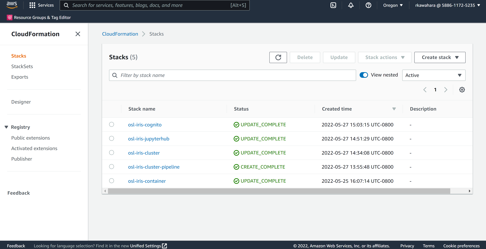
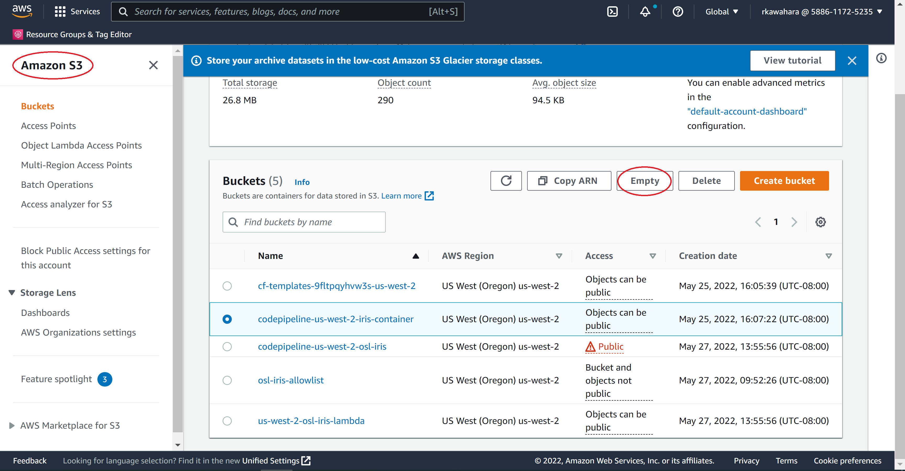
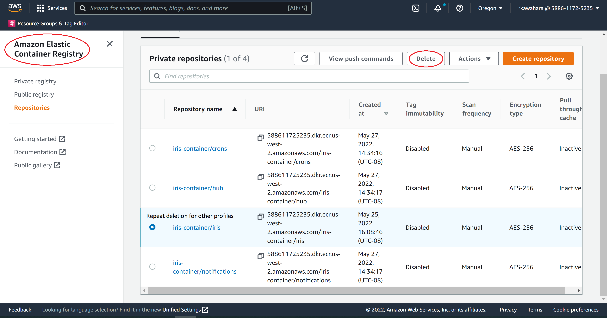
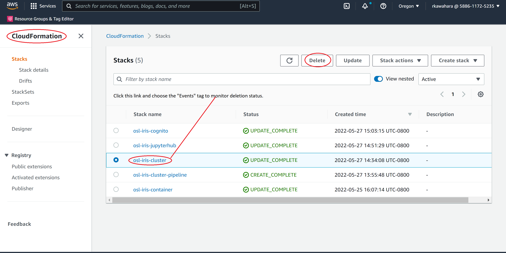
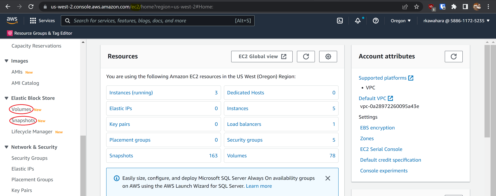
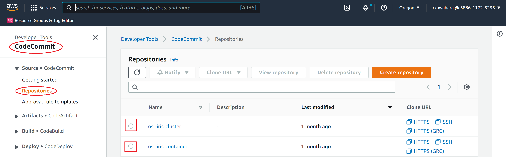
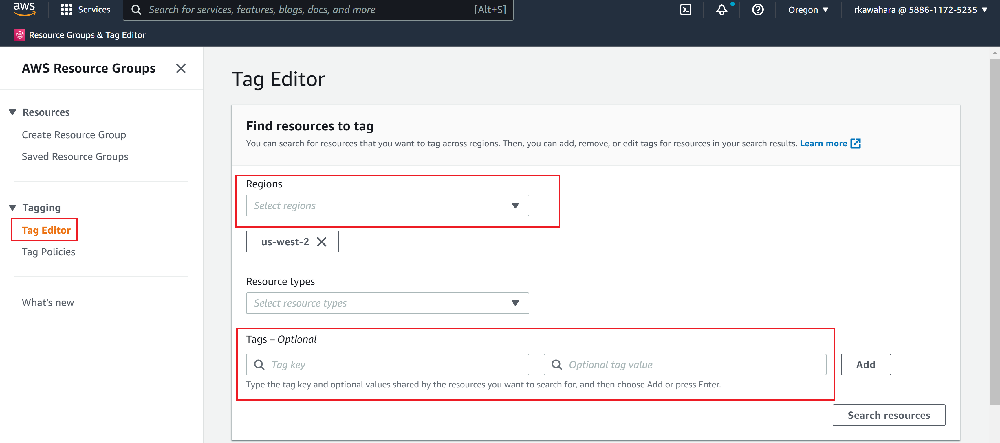

[Return to Developer Guide](../dev.md)

Deploy OpenSARlab to an AWS account
=====================

**A note about deployments:** A deployment of OpenSARlab refers to a standalone instance of OpenSARlab.
If you are setting up OpenSARlab for several classes and/or collaborative groups with disparate needs or funding sources,
it may be useful to give them each their own standalone deployment. This separates user group authentication, 
simplifies billing for each group, and allows for easy cleanup at the end of a project or class (just delete the deployment).
In the following instructions, replace any occurrence of "`deployment_name`" with the deployment name you have chosen.

**Make your deployment name lowercase and use no special characters other than dashes (-). It will be used to
generate part of the Cognito callback URL and CloudFormation stack names also follow the same naming convention.**    

Take AWS SES out of sandbox
--------------------

**The AWS Simple Email Service is used by OpenSARlab to send emails to users and administrators. These include
authentication related notifications and storage lifecycle management messages.**

While SES is in sandbox, you are limited to sending 1 email per second with no more than 200 in a 24 hour period, and they
may only be sent from an SES verified address to other SES verified addresses.

Note: Provide a detailed explanation of your SES use and email policies when applying to exit the sandbox or you will be denied.

**Approval can take 24-48 hours** 

1. Follow these [instructions](https://docs.aws.amazon.com/ses/latest/DeveloperGuide/request-production-access.html) to 
take your SES out of sandbox.


Create an AWS Cost Allocation Tag
--------------------
**Note: only management accounts can create cost allocation tags**

1. Create a cost allocation tag or have one created by someone with access
    1. Give it an available name that makes sense for tracking deployment names associated with AWS resources
        1. i.e. "deployment_name"
        
Add dockerhub credentials to AWS Secrets Manager    
--------------------        
**This deployment uses a few publicly available docker images. Due to dockerhub rate limits ([https://www.docker.com/increase-rate-limits](https://www.docker.com/increase-rate-limits)), 
you will need to set up a dockerhub account. A free-tier account will suffice. CodePipeline's ip address is shared by many
users and you will likely hit the rate limit as an anonymous user 
([details here](https://aws.amazon.com/blogs/containers/advice-for-customers-dealing-with-docker-hub-rate-limits-and-a-coming-soon-announcement/)).**

Note: By default this secret will be used for multiple deployments. Optionally, you could edit the codebuild section in the cf-cluster.yml to 
point to a different secret.

1. If you don't have a dockerhub account, create one [here](https://hub.docker.com/signup)
1. Open the AWS Secrets Manager console
1. Click the "Store a new secret" button
    1. Page 1:
        1. Select "Other type of secrets"
        1. Select the "Plaintext" tab
        1. Delete the default content
        1. Add your username and password, separated by a space
            1. Example: `username password`
        1. Click the "Next" button
    1. Page 2:
        1. Secret name
            1. `dockerhub/creds`
            1. Click the "Next" button
    1. Page 3:
        1. Click the "Next" button
    1. Page 4:
        1. Click the "Store" button
        
Setup an iCal calendar for notifications
--------------------
**Notifications are generated from iCal calendar events. ASF uses Google Calendar but any publicly accessible iCal 
formatted calendar should work as well**

1. Create a public iCal formatted calendar
1. The iCal formatted url will be needed in later
1. Notification calendar events must be properly formatted.
    1. Formatting details available in the [Take care of odds and ends](#Take-care-of-odds-and-ends) section

Store your CA certificate
--------------------
**OpenSARlab will lack full functionality if not using https (SSL certification)**

1. Follow these [instructions](https://docs.aws.amazon.com/acm/latest/userguide/import-certificate.html) to import your CA certificate into the AWS Certificate Manager

Prepare CodeCommit Repos
--------------------
TODO Do this differently 

**All the public OpenSARlab repos are in the [ASFOpenSARlab](https://github.com/ASFOpenSARlab) Github Org**

1. Create a `deployment_name`-container CodeCommit repo in your AWS account
1. Create a `deployment_name`-cluster CodeCommit repo
1. Clone the `deployment_name`-container and `deployment_name`-cluster repos to your local computer using ssh
1. cd into your local `deployment_name`-container repo
    1. add ASFOpenSARlab/opensarlab-container as a remote on your local `deployment_name`-container repo
        1. `git remote add github https://github.com/ASFOpenSARlab/opensarlab-container.git`
    1. Pull the remote  opensarlab-container repo into your local `deployment_name`-container repo
        1. `git pull github main`
    1. Create a main branch in the `deployment_name`-container repo
        1. `git checkout -b main`
    1. Push to the remote `deployment_name`-container repo
        1. `git push origin main`
1. cd into your local `deployment_name`-cluster repo
    1. add ASFOpenSARlab/opensarlab-cluster as a remote on your local `deployment_name`-cluster repo
        1. `git remote add github https://github.com/ASFOpenSARlab/opensarlab-cluster.git`
    1. Pull the remote  opensarlab-cluster repo into your local `deployment_name`-cluster repo
        1. `git pull github main`
    1. Create a main branch in the `deployment_name`-cluster repo
        1. `git checkout -b main`
    1. Push to the remote `deployment_name`-cluster repo
        1. `git push origin main`
        
**You should now have container and cluster repos in CodeCommit that are duplicates of those found in ASFOpenSARlab** 

Customize opensarlab_container code for deployment
--------------------
**The opensarlab-container repo contains one example image named `helloworld`, which you can reference when creating new images.
Images can be used by multiple profiles**

Note: It is easiest to work in your local repo and push your changes when you're done.

1. Duplicate the `images/sar` directory and rename it, using your chosen image name
   1. The image name must be alpha-numeric with no whitespaces or special characters
1. Edit the dockerfile
    1. Adjust the packages in the 2nd apt install command to suit your image needs
    1. Add any pip packages you wish installed in the base conda environment
    1. Add any conda packages you wish installed in the base conda environment
    1. Create any conda environments you would like pre-installed before "USER jovyan"
        1. If using environment.yml files, store them in an "envs" directory in <image_name>/jupyter-hooks, and they will be copied into the container
            1. RUN conda env create -f /etc/jupyter-hooks/envs/<environment_name>_env.yml --prefix /etc/jupyter-hooks/envs/<environment_name>
    1. Run any tests for this image that you added to the tests directory under `FROM release as testing`
1. Remove the images/sar directory and sar.sh test script, unless you plan to use the sar image
1. Add a test script for your image
    1. use sar.sh as an example
    1. name it <image_namespace>.sh
1. Add, commit, and push changes to the remote CodeCommit repo

Customize opensarlab_cluster code for deployment
--------------------
1. Create and add any additional custom jupyter magic commands to the `opensarlab/jupyterhub/singleuser/custom_magics` directory Add any additional scripts you may have created for use in your image to the `opensarlab/jupyterhub/singleuser/hooks` directory
1. Duplicate `opensarlab/jupyterhub/singleuser/hooks/sar.sh`, renaming it after your image name
   1. Edit `opensarlab/jupyterhub/singleuser/hooks/<image_name>.sh`
       1. Copy any additional custom Jupyter magic scripts to `$HOME/.ipython/image_default/startup/` (alongside 00-df.py)
       1. Edit the repos being pulled to suit your deployment and image needs
1. Rename `opensarlab/opensarlab.example.yaml` to  `opensarlab/opensarlab.yaml`
   1. Use the example notes in `opensarlab/opensarlab.yaml` to define the required and optional fields
1. Update `opensarlab/jupyterhub/helm_config.yaml`
    1. `singleuser`
       1. Add any needed extraFiles
    1. `hub`
       1. Add any needed extraFiles
1. Add, commit, and push changes to the remote CodeCommit repo

Build the container CloudFormation stack
--------------------
**This will create the hub image, images for each profile, and store them in namespaced ECR repos**

1. Open CloudFormation in the AWS console
    1. Click the "Create stack" button and select "With new resources (standard)"
        1. Page 1 : **Create stack**
            1. Under "Specify template", check "Upload a template file"
            1. Use the file chooser to select **cf-container.py** from your local branch of the `deployment_name`-container repo 
            1. Click the "Next" button
        1. Page 2: **Specify stack details**
            1. `Stack Name`
               1. Use a recognizable name that makes sense for your deployment
            1. `CodeCommitSourceRepo`
                1. The CodeCommit repo holding the container code (`deployment_name`-container)
            1. `CodeCommitSourceBranch`
                1. The name of the production branch of the `deployment_name`-container CodeCommit repo
            1. `CostTagKey`
               1. The cost allocation key you registered for tracking deployment costs
            1. `CostTagValue`
                1. `deployment_name`
        1. Page 3: **Configure stack options**
            1. Tags:
                1. Key: Cost allocation tag
                1. Value: `deployment_name`
            1. Click the "Next" button
        1. Page 4: **Review `Stack Name`**
            1. Review and confirm correctness
            1. Check the box next to "I acknowledge that AWS CloudFormation might create IAM resources"
            1. Click the "Create Stack Button"
    1. Monitor the stack build for errors and rollbacks
        1. The screen does not self-update
            1. Use the refresh buttons
        1. If the build fails and rolls back
            1. goto the CloudFormation stacks page 
                1. select and delete the failed stack before correcting any errors and trying again
    
Build the cluster CloudFormation stack
--------------------
**This CloudFormation stack dynamically creates 3 additional stacks.**

1. Open CloudFormation in the AWS console
    1. Page 1 : **Create stack**
        1. Click the "Create stack" button and select "With new resources (standard)"
        1. Under "Specify template", check "Upload a template file"
        1. Use the file chooser to select `opensarlab/pipeline/cf-pipeline.yaml` from your local branch of the cluster repo 
        1. Click the "Next" button
        1. Page 2: **Specify stack details**
            1. `Stack Name`
               1. Use a recognizable name that makes sense for your deployment. **Do not use a stack name that ends in `cluster`, `jupyterhub`, or `cognito`. These are reserved.**
            1. `CodeCommitRepoName`
                1. The CodeCommit repo holding the container code (`deployment_name`-cluster)
            1. `CodeCommitBranchName`
                1. The name of the production branch of the `deployment_name`-cluster CodeCommit repo
            1. `CostTagKey`
               1. The cost allocation key you registered for tracking deployment costs
            1. `CostTagValue`
                1. `deployment_name`
    1. Page 3: **Configure stack options**
        1. Tags:
            1. Key: Cost allocation tag
            1. Value: `deployment_name`
        1. Click the "Next" button
    1. Page 4: **Review `Stack name`**
        1. Review and confirm correctness
        1. Check the box next to "I acknowledge that AWS CloudFormation might create IAM resources"
        1. Click the "Create Stack" button

Take care of odds and ends
--------------------

1. Update `deployment_url` in the cluster repo `opensarlab/opensarlab.yaml` if you started off using `load balancer`
    1. Don't forget to update your DNS record
1. Add the cost allocation tag to the EKS cluster
    1. Navigate to the AWS EKS console
    1. click the "Clusters" link in the sidebar menu
        1. Click on cluster stack
            1. Click the "Tags" tab
                1. Click the "Manage tags" button
                    1. Click the "Add tag" button
                        1. Key: Cost allocation tag
                        1. Value: `deployment_name`
1. Prime the Auto Scaling Group for each profile unless there are active users
    1. Navigate to the AWS EC2 console
        1. Select the "Auto Scaling Groups" sidebar link
            1. Select an autoscaling group
                1. Group details:
                    1. Click the "Edit" button
                        1. Desired capacity:
                            1. Set to 1
                        1. Click the "Update" button
1. Create a test notification
    1. Navigate to your notification calendar
    1. Create an event
        1. Set the event to last as long as you wish the notification to display
        1. The event title will appear as the notification title
        1. The description includes a metadata and message section
            1. Example:
                1. ```
                      <meta>
                      profile: MY PROFILE, OTHER PROFILE
                      type: info

                      <message>
                      This is a notification
                   ```
            1. \<meta\>
                1. profile:
                    1. Holds the name or names (comma separated) of the profiles where the notification will be displayed
                1. type:
                    1. info
                        1. blue notification
                    1. success
                        1. green notification
                    1. warning
                        1. yellow notification
                    1. error
                        1. red notification
            1. \<message\>
                1. Your notification message
1. Sign up with your `admin_user_name` account, sign in, and add groups for each profile and sudo
    1. Open the `deployment_url` in a web browser
        1. Click the "Sign in" button
            1. Click the "Sign up" link
            1. Username:
                1. The name used for the `admin_user_name` parameter of the `opensarlab.yaml`
            1. Name:
                1. Your name
            1. Email:
                1. Enter the email address used for the AdminEmailAddress parameter in the `deployment_name`-auth CloudFormation stack
            1. Password:
                1. A password
            1. Click the "Sign up" button
                1. Verification Code:
                    1. The verification code sent to your email address
                1. Click the "Confirm Account" button
    1. Add a group for each profile and for sudo
        1. After confirming your account you should be redirected to the Server Options page
        1. Click the "Groups" link at the top of the screen
        1. Click the "Add New Group" button
            1. Group Name:
                1. The group name as it appears in the helm_config.yaml group_list
                    1. Note that this is not the display name and it contains underscores
            1. Group Description:
                1. (optional) Enter a group description
            1. Group Type:
                1. check "action"
                    1. This has no effect, but is useful for tracking user groups vs. profile groups
            1. All Users?:
                1. Check if you wish the profile to be accessible to all users
            1. Is Enabled?:
                1. check the box
            1. Click the "Add Group" button
            1. Repeat for all profiles
            1. Repeat for a group named "sudo"
                1. Do not enable sudo for all users!
                1. This is useful for developers but avoid giving root privileges to regular users
            1. Click the "Home" link at the top of the screen
    1. Start up and test each profile
        1. Click the "Start My Server" button
        1. Select a profile
            1. Click the "Start" button
        1. Confirm that the profile runs as expected
            1. Test notebooks as needed
            1. Confirm that notifications appear
        1. Repeat for each profile
1. Configure your local K8s config so you can manage your EKS cluster with kubectl
    1. Add your AWS user to the trust relationship of the `deployment_name`-cluster-access IAM role
        1. Navigate to the AWS IAM console
            1. Click the "Roles" link from the sidebar menu
                1. Select the `deployment_name`-cluster-access IAM role
                    1. Click the "Trust relationships" tab
                    1. Click the "Edit trust relationship" button
                        1. Add your AWS user ARN
                        1. Example json:
                            1. ```json
                                {
                                 "Version": "2008-10-17",
                                 "Statement": [
                                   {
                                     "Effect": "Allow",
                                     "Principal": {
                                       "AWS": [
                                         "arn:aws:iam::<account_#>:user/<username>"
                                       ]
                                     },
                                     "Action": "sts:AssumeRole"
                                   }
                                 ]
                                }
                               ```      
                        1. Click the "Update Trust Policy" button          
    1. Add an AWS profile on your local machine
        1. Example profile:
            1. ```yaml
                [profile profile_name]
                source_profile = your_source_profile
                region = your_region
                role_arn = arn:aws:iam::<account_id>:role/<region_name>-<deployment_name>-cluster-user-access
                cluster_name = <deployment_name>-cluster              
                ```
    1. Run the helps/get_eks_kubeconfig.sh script in the opensarlab-cluster repo
        1. Note: you will use this a lot and it may be helpful to create an alias in ~/.bash_aliases
    1. Use kubectl
    
<!-- --- -->

<!-- # **Destroy Deployments**

It is essential to destroy a deployment at the end of its life cycle so that no resources are left in place. With a proper destruction procedure, one can mitigate the accrued cost of AWS. 

---

## **WARNING:** Before deleting the deployments, developers will need to account for the following: 

- When deleting the `CloudFormation` stack, the deletion order matters.
- Delete some of the `CloudFormation` stacks before deleting ECR.
- The name of the items you're deleting may differ depending on the deployment you are taking down. For example, your deployment's `CloudFormation` stack may not have a `region` name or may not have a `<deployment-name>-auth` stack.
- Do **NOT** take down the `Cognito` and `CloudWatch` logs. These are used for statistical analysis later on.

---

## **Removing CloudFormation Stacks**

---

When you first go to CloudFormation, it should look something like the following:




Because the order of removing deployment is essential, you will need to take down the `CloudFormation` stacks first. Deleting the following CloudFormation stacks will kill the deployment and remove its resources:

- `<deployment_name>-container`
- `<deployment_name>-auth`
- `<deployment_name>-cluster`
- `deployment_name`

---

_**NB**_: **Do not manually delete any S3 buckets after emptying them** in the steps below.

If you delete the buckets after emptying them, the `CloudFormation` stack deletions associated with those buckets will fail. To fix the issues regarding deleted buckets, you will have to recreate the empty buckets to proceed. 

Therefore, let `CloudFormation` delete the S3 buckets for you once you empty them.

---

Follow the below instructions to properly delete these stacks.

---

## **Steps to Delete `CloudFormation` Stacks**

---

### **1. Prepare to delete the `<deployment_name>-container` CloudFormation stack**
    
_NB: The `<deployment_name>-container` is independent of other stacks, i.e., the deletion order does not matter._

1. Empty the `codepipeline-<region>-<deployment_name>-container` S3 bucket



2. Navigate to the AWS S3 console
    1. Click the `codepipeline-<region>-<deployment_name>-container` S3 bucket option.
    1. Click the `Empty` button
        1. Confirm the deletion of bucket contents by typing `permanently delete` in the provided field
        1. Click the `Empty` button

### **2. Delete ECR repos for each profile**

1. Navigate to the AWS Elastic Container Registry



2. Click the option next to the `<deployment_name>/<profile_namespace>` repository
3. Click the `Delete` button
    1. Confirm the deletion by typing `delete` in the provided field
    1. Click the `Delete` button
4. Repeat for each profiles


### **3. Delete the `<deployment_name>-container` CloudFormation stack**
1. Navigate to the AWS CloudFormation console



1. Click the `<deployment_name>-container` stack option
1. Click the `Delete` button
    1. Click the `Delete Stack` button
1. Click the `<deployment_name>-container` stack name
    1. Click the `Events` tab
    1. Monitor the stack deletion progress
        1. Click the refresh button periodically since the console doesn't update events automatically

_NB: Stack deletion process will be similar to above instructions for other stacks._

---

## **Deleting the rest of the `CloudFormation` Stacks**

---

Unlike the `container` stack, the deletion order matters for the rest. On the bright side, the deletion process should be similar to the `container` stacks.

Specifically, you will need to delete your stacks in the following order:

1. `<deployment_name>-auth` stack (if applicable)
2. `<deployment_name>-jupyterhub` stack
3. `<deployment_name>-cluster` stack
4. *`<deployment_name>-cluster-pipeline` stack
5. *`<deployment_name>` stack (if applicable)

_NB:*These stacks have additional steps._

**WARNING: As mentioned earlier, do NOT delete the `<deployment_name>-cognito` stack.**

In above order, follow these steps (except for stack 4 and 5):

1. Delete the `<deployment_name>-<stack_name>` CloudFormation stack
    1. Navigate to the AWS CloudFormation console
        1. Click the box next to the `<deployment_name>-<stack_name>` stack
        1. Click the `Delete` button
                1. Click the `Delete stack` button
        1. Click the `<deployment_name>-<stack_name>` stack name
            1. Click the `Events` tab
            1. Monitor the stack deletion progress
                1. Click the refresh button periodically since the console doesn't update events automatically


If you are deleting stack 4 (`<deployment_name>-cluster-pipeline`), you will need to follow these steps first before deleting the stack:


1. Navigate to the AWS S3 console
    1. If exists, click the `<region>-<deployment_name>-lambda` S3 bucket option.
    1. Click the `Empty` button
        1. Confirm the deletion of bucket contents by typing `permanently delete` in the provided field
        1. Click the `Empty` button

If you are deleting stack 5 (`<deployment_name>`), you will need to follow these steps first before deleting the stack:

1. Delete the `deployment_name` CloudFormation stack
    1. Delete hub and notifications ECR repos
        1. Navigate to the AWS Elastic Container Registry
        1. Click the box next to the `deployment_name`/hub repository
        1. Click the `Delete` button
            1. Confirm the deletion by typing "delete" in the provided field
            1. Click the `Delete` button 
        1. Repeat the above steps for the `deployment_name`/notifications repository
    1. Empty the `codepipeline-<region>-<deployment_name>` S3 bucket
        1. Navigate to the AWS S3 console
            1. Check the box next to the `codepipeline-<region>-<deployment_name>` S3 bucket
            1. Click the `Empty` button
                1. Confirm the deletion of bucket contents by typing `permanently delete` in the provided field
                1. Click the `Empty` button
---

## **Delete EBS Snapshots and Volumes**

To mitigate the cost associated with storage space, it is crucial to deallocate unused resources. The below steps will guide you on how to do so.

---

First, navigate to the AWS EC2 console - this step should be identical for both EBS snapshots and EBS volumes.



### **Delete EBS snapshots**
1. Click the _Snapshots_ link in the sidebar menu
    1. Filter by osl-stackname: `<deployment_name>`
        1. **Double check that you filtered for the correct deployment!**
    1. Select all snapshots
    1. Select `Delete` from the `Actions` menu
    1. Confirm by clicking the `Yes, delete` button

### **Delete EBS volumes**
1. Navigate to the AWS EC2 console
1. Click the _Volumes_ link in the sidebar menu
    1. Filter by osl-stackname: `<deployment_name>`
        1. **Double check that you filtered for the correct deployment!**
    1. Select all volumes
    1. Select `Delete volumes` from the `Actions` menu
    1. Confirm by clicking the `Yes, delete` button             

---

## **(Optional) Delete the CodeCommit repositories**

This section will guide you on how to remove the  `<deployment_name>-container` and `<deployment_name>-cluster` repositories located in the CodeCommit.

_**Important Note:**_ Often, it would be in your best interest to preserve the CodeCommit repositories since the cost of maintaining them are minuscule. 

If you believe that you may re-deploy the same deployment, you may want to ease future work in one of the following manners:

1. Leaving these repositories in place, i.e., don't delete them.
1. Download the zip of your repositories, store them in S3, and then delete them. 

In another word, delete the CodeCommit repositories if and only if you are sure that you don't need them.

---

First, navigate to the AWS CodeCommit console:



Then delete the `<deployment_name>-container` and `<deployment_name>-cluster` in any order. The deletion process for these two repositories is following:

1. Check the option next to the repository
1. Click the `Delete repository` button
1. Confirm the deletion by typing `delete` in the provided field     
1. Click the `Delete` button

--- 

## **(Optional) Confirm that all resources have been deleted**

Once you've taken down the deployment, you may want to verify the resource usage. 

---



1. Wait a day for deleted resources to update in the tag editor
1. Navigate to the AWS Resource Groups and Tag Editor console
    1. Select the _Tag Editor_ link in the sidebar menu and fill in the following:
        1. Regions: `<current-region>`
        1.  Tags:
            1. `Key`: Cost allocation tag
            1. `Value`: `<deployment_name>`
        1. Click the `Search resources` button
        1. Identify and delete any remaining resources -->