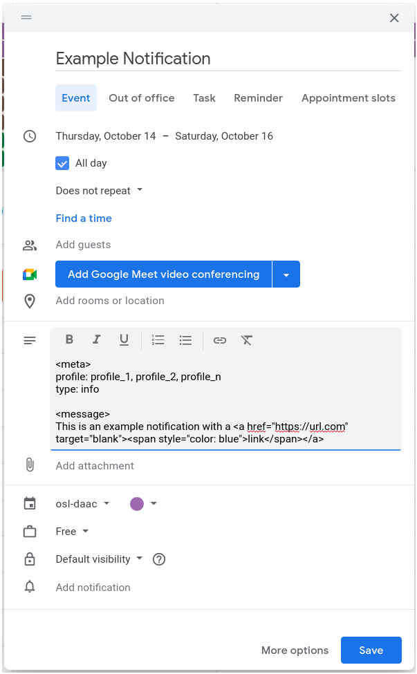

[Return to Developer Guide](../dev.md)

# Create OpenSARlab Notifications 

1. Create a new event in your notification calendar
    1. The event title corresponds to the notification title
    1. Select the time or date range for which you would like to display the notification
    1. The remaining notification details are included in the event description
        1. Add a `\<meta>` tag
            1. Define profiles for which to display notification
                1. `profile: profile_1,profile_2,profile_n`
                    1. **Note:** comma separated with no spaces
            1. Define notification type
                1. `type: info` is blue
                1. `type: warning` is yellow
                1. `type: success` is green
                1. `type: error` is red
            1. *Optional* hide notification
                1. `mute: true`
        1. Add a `\<message>` tag
            1. Add your message body as html
                1. Add line breaks
                    1. `\ `
                1. Add links
                    1.  `\<a href="https://url.com" target="blank">\link\\</a>`
                        1. **Note:** You must unlink the URL using the unlink button in the calendar message tool bar for it to work.
               
        
        
