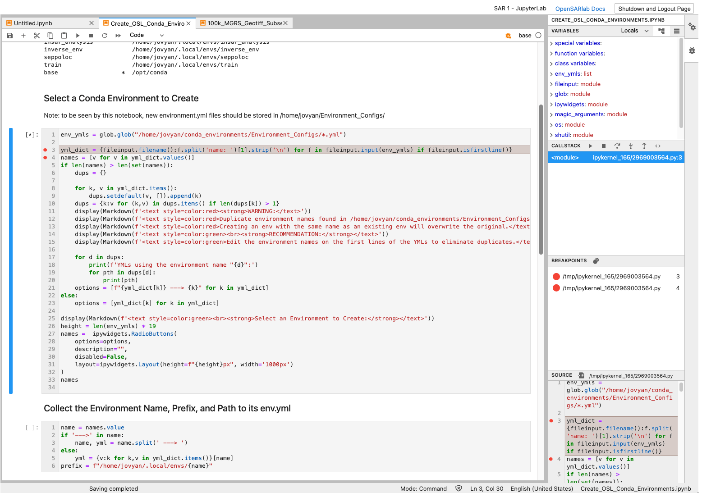
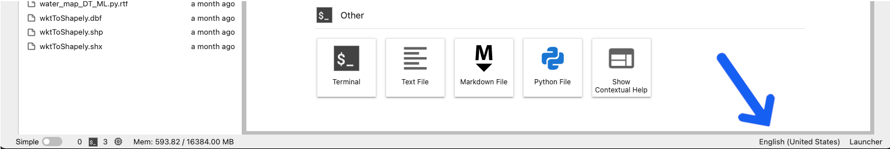

# Welcome to the February 2022 OpenSARlab Update!

### Changes:
- Ubuntu 20.04.3 LTS
- JupyterLab
- Matplotlib widget
- Url-widget
- New memory monitor location
- Notebook Debugger
- Mamba
- Mamba Gator
- Spellchecker
- Custom extensions
- Recommended Jupyter Notebook changes related to update
  
## Ubuntu 20.04.3 LTS

- JupyterHub is now running on Ubuntu 20.04.3 LTS, updated from Ubuntu 18.04

## JupyterLab

- There are now JupyterLab profiles available alongside the Classic Jupyter Notebook profiles. JupyterLab comes with many more features than Classic Jupyter Notebook (see the [JupyterLab Docs](https://jupyterlab.readthedocs.io/en/stable/user/interface.html)) for more information.
- Classic Jupyter Notebook profiles will remain active for 1 month before being deprecated on March 7th.

## Matplotlib widget

- `matplotlib notebook` has been replaced with `matplotlib widget` for interactive matplotlib plots.
    - `matplotlib notebook` will not work in JupyterLab, whereas `matplotlib widget` works in both JupyterLab and Classic Jupyter Notebook.

## Url-widget

- The `url-widget` package is now installed, allowing notebook Python kernels access to the current notebook's URL.
    - This is useful for dynamically creating links to files and notebooks in OpenSARlab, and it is used in the kernel checking code at the beginning of ASF provided notebooks.
    
## New Memory Monitor Location

- JupyterLab comes with a built-in memory monitor, replacing the jupyter-resource-usage extension.
    - The new memory monitor can be found in the status bar at the bottom of the JupyterLab screen.


## Notebook Debugger

- JupyterLab comes with a built-in notebook debugger.
    - [JupyterLab Debugger Docs](https://jupyterlab.readthedocs.io/en/stable/user/debugger.html)



## Mamba

- The [mamba package manager](https://github.com/mamba-org/mamba) is now available in OpenSARlab.
    - Mamba is a multi-threaded "reimplementation of the conda package manager in C++."
      - It creates environments much more quickly than conda.
- The [opensarlab-envs repo](https://github.com/ASFOpenSARlab/opensarlab-envs) has been updated to use mamba.

## Mamba Gator is installed

- [mamba gator](https://github.com/mamba-org/gator) provides a GUI for managing conda/mamba environments that is accessible in JupyterLab.
    - Access mamba gator by selecting the  `Conda Packages Manager` from the `Settings` menu.

## Spellchecker

- The [spellchecker extension](https://github.com/jupyterlab-contrib/spellchecker) is installed.
    - It checks spelling in markdown cells.
    - The language may be changed in the status bar at the bottom of the screen.



## Custom Extensions

- We have added some custom JupyterLab extensions to duplicate custom features previously added in OpenSARlab for Jupyter Notebooks.
    - [opensarlab-profile-label](https://pypi.org/project/opensarlab-profile-label/) provides the name of the current OpenSARlab profile in the topbar.
    - [opensarlab-doc-link](https://pypi.org/project/opensarlab-doc-link/) provides a link to the [OpenSARlab documentation](https://opensarlab-docs.asf.alaska.edu/) in the topbar.
    - [opensarlab-controlbtn](https://pypi.org/project/opensarlab-controlbtn/) provides a `Shutdown and Logout Page` button in the topbar.
    - [opensarlab-notifications](https://pypi.org/project/opensarlab-notifications/) provides similar functionality to the popup notifications used in the OpenSARlab Classic Jupyter Notebook profiles.

## Recommended Jupyter Notebook Changes

The following bullet points cover code changes you may need to make to your notebooks for them to work in JupyterLab

*note: These changes are backwards compatible and updated notebooks will still run in Jupyter Notebook.*

*note: All [ASF notebooks](https://github.com/ASFOpenSARlab/opensarlab-notebooks) have already been updated.*


- The javascript variable `Jupyter.notebook.kernel` does not exist in JupyterLab.
    - If you need a Python variable containing a notebook's current Python kernel, run:
        - `env = !echo $CONDA_PREFIX`
- The javascript variable `window.location` does not exist in JupyterLab
    - If you need the current url of your Jupyter workspace, install the `url-widget` package in your conda environment and use it to retrieve the url:
```python
# In one cell
import url_widget as url_w
notebook_url = url_w.URLWidget()
display(notebook_url)
```

```python
# In a following cell
notebook_url = notebook_url.value
```
- `%matplotlib notebook` does not work for interactive plotting in JupyterLab
    - Instead, use: `%matplotlib widget`
- `asf_notebook.py` is deprecated and has been replaced with `opensarlab-lib`: [https://github.com/ASFOpenSARlab/opensarlab-lib](https://github.com/ASFOpenSARlab/opensarlab-lib)
    - `asf_notebook.py` still works (with deprecation warnings) but it is not being maintained. 
    - Install and use `opensarlab-lib` instead.
        - `python -m pip install opensarlab-lib` 
      
      or
  
        - `conda install -n <environment_name> -c conda-forge opensarlab-lib`