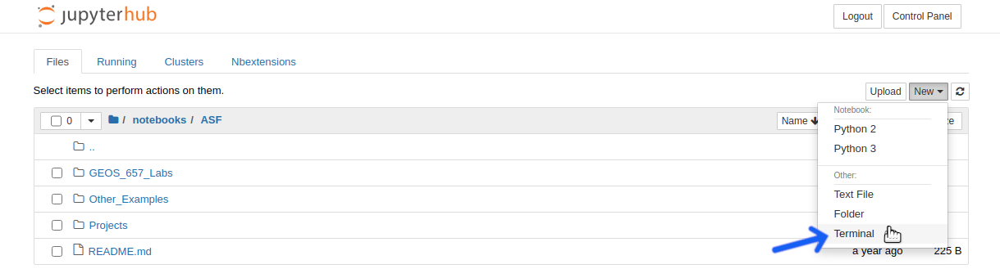
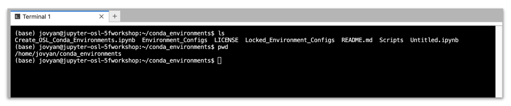
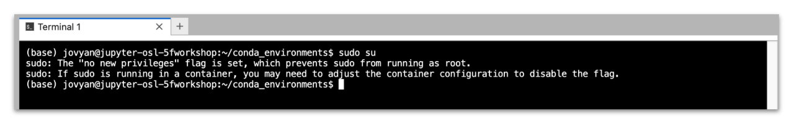

[Return to Table of Contents](../user.md)

# Using the Terminal in OpenSARlab

### Open a Terminal

*Select **Terminal** from the **New** menu in the JupyterHub file manager*

---
 
### Use the Terminal

*Use the command line as you would in any other Linux terminal*

---
 
### No Root Privileges

*OpenSARlab users do not have `sudo` privileges (`jovyan` does not have a password).*

---