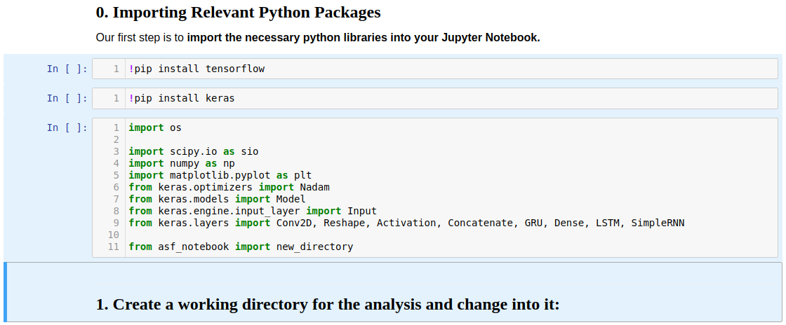

[Return to Table of Contents](../user.md)

# How to Run a Jupyter Notebook

### Before we get started, what is Jupyter Notebook?
- [Intro to Jupyter Notebook](jupyter_notebook_intro.md)

## Selecting Cells
#### Select a Single Cell in Non-Edit Mode
- Click to the left of a cell

*A selected cell in non-edit mode is surrounded by a box with a blue left edge*

---
 
#### Select Multiple Cells in Non-Edit Mode
1. Select a cell in non-edit mode
- 'Shift + J' or 'Shift + Down-Arrow' selects additional cells below
- 'Shift + K' or 'Shift + Up-Arrow' selects additional cells above
- Perform batch operations on selected cells

*Multiple selected cells are surrounded by a blue highlighted box*

---

#### Select a Code Cell in Edit Mode
- Click inside a cell

 

*A selected cell in non-edit mode is surrounded by a box with a green left edge*

---
 
#### Select a Markdown Cell in Edit Mode
- Double click inside a cell

 

*A markdown cell in edit mode is surrounded by a box with a green left edge*

---
 
 
## Running Cells

*Since code cells may be run in any order, they are numbered in the order they were run.*
 
---

### Run a Single Code or Markdown Cell
#### With the Run Button
1. Select a cell in edit or non-edit mode
1. Click the Run button

*Click the Run button to run a selected cell*

---
 
#### With Hotkeys 
1. Select a cell in edit or non-edit mode
- 'Ctrl + Enter' runs a cell
- 'Shift + Enter' runs a cell and selects the cell below
- 'Alt + Enter' runs a cell and inserts an empty cell below

### Run a Cell and every Cell Above or Below It
1. Select a cell in edit or non-edit mode
- Select 'Run All Above' from the Cell Menu
- Select 'Run All Below' from the Cell menu

### Run a batch of selected cells
1. Select a group of cells
- Click the 'Run' Button
- Select 'Run Cells' from the Cells menu

### Run an Entire Notebook
- Select 'Run All' from the Cells Menu (does not restart the kernel)
- Select 'Restart & Run All' from the Kernel Menu

### Rerunning a Notebook
It is a best-practice to restart the notebook kernel before rerunning a notebook. This is because any initialized variables and data structures from a previous run will be stored in memory, along with their values, which can lead to unintended results.

An example of how you might get into trouble would be a code cell that creates a new subdirectory directory in your current working directory called "data" and moves into it. If you start in ~/notebooks, then after running the code cell once, you will be in ~/notebooks/data. If you run the cell a second time, you will be in ~notebooks/data/data. If you keep rerunning the cell, you will find yourself inside a deeply nested data directory, ~notebooks/data/data/data/data/data/data/. 
  
- Select 'Restart' from the Kernel Menu
- Select 'Restart & Clear Output' from the Kernel Menu
- Select 'Restart & Run All' from the Kernel Menu

## Clearing Cell Output Before Closing

It is best practice to clear all code cells output prior to closing or saving a notebook. Leaving the output in place can lead to a tenfold increase in a notebook's file size. Not only does this use up more of your volume, it leads to slow notebook loading times (especially if you have a slow internet connection).

 
 

