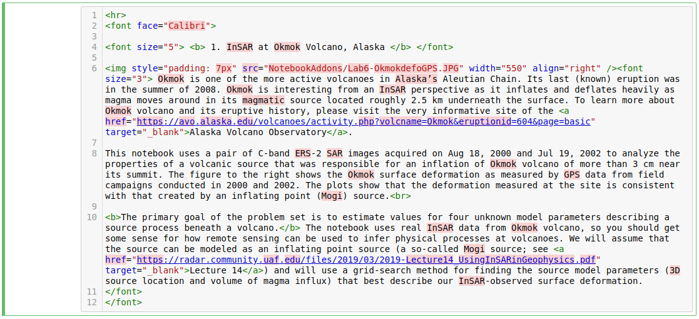
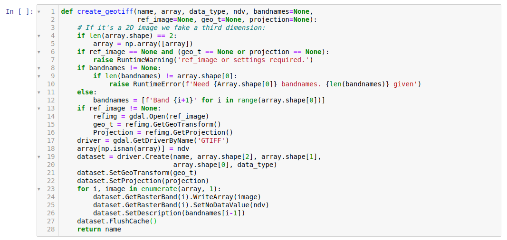

[Return to Table of Contents](../user.md)

# A Light Introduction to Jupyter Notebook
[https://jupyter.org/](https://jupyter.org/)

Jupyter Notebook is a web application that allows users to display: 

* Interactive and runnable code cells, which is typically written in [Python](https://docs.python.org/3/)
* [Markdown](https://jupyter-notebook.readthedocs.io/en/stable/examples/Notebook/Working%20With%20Markdown%20Cells.html) cells containing explanatory text, formulas, hyperlinks, tables, pseudocode, images, etc.

Jupyter Notebook provides an ideal format for teaching/learning coding concepts, prototyping algorithms, and collaborating on Python projects. 

<!-- bullet points causes issue on HTML -->
## Cells
Jupyter Notebook has 4 cell types. In OpenSARlab, we use the following two:

- Markdown cells
- Code cells
 
### Markdown Cells
---
Markdown cells contain documentation in Markdown, HTML, and/or LaTeX. They are often used to display text, images, hyperlinks, formulas, tables, pseudocode, plots, figures, etc. 

-  To enter edit mode in a markdown cell, double click it.

  

*A markdown cell in edit mode*

---

If you:

- Want to proceed through the notebook past the markdown cell.
- Run a markdown cell's code to display its formatted contents.

Click the **play** button at the top of the notebook or hit `shift + enter`.
 

*A run markdown cell*
<!--  maybe include image of actually hitting "play" button -->

---
 
### Code Cells
---
 Code cells contain editable and runnable Python code. You can run them in any order for any number of times.
 
 The ability to run/rerun code cells in arbitrary order can be helpful, but it can also cause problems. 
 
*e.g.* Recycled variables may end up with unexpected values if cells are run in non-sequential order.

 

*A code cell*

---
