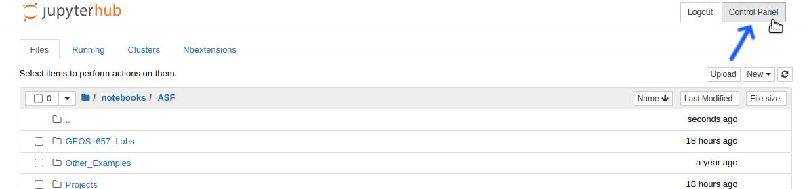
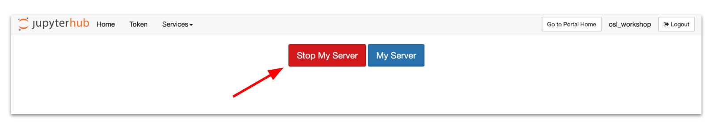
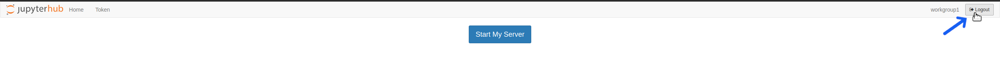

[Return to Table of Contents](../user.md)

# Logging Out of OpenSARlab and Shutting Down the Server

<!-- definitive statement > suggestion  -->
When you are ready to stop working in OpenSARlab, it is important to shut down your server and also logout.

<!-- Should we still include potential auto shutdown? -->
## Why Shut Down the Server?
<!--prev
 If the server is inactive for an hour, it will shut down automatically, but users should not rely upon this feature.  -->

Always assume that logging out will not shut down the server on its own. While server may shut down automatically after an hour of inactivity, user should not rely on this feature. 

If there are any process running in your account, they will keep your server alive, and it is not always apparent that there is a process running. If you login for the first time in a day or two and notice that a Jupyter Notebook is still running, your server ran that whole time. 

Do your part to reduce resource use and ease the burden on the environment by shutting down your server when you are finished working for the day. 

**In some instances you may need to leave your server running, which is perfectly acceptable. Perhaps you have a notebook performing a very time intensive analysis and wish to let it run overnight.**

## How to Shut Down The Server and Logout

#### Click The Control Panel Button

*Click the Control Panel button at the top right of the file manager or in an open notebook*

---

### Click The Stop My Server Button

*Click the Stop My Server button that appears*

---

### Click The Logout Button

*Click the Logout button*

---

 