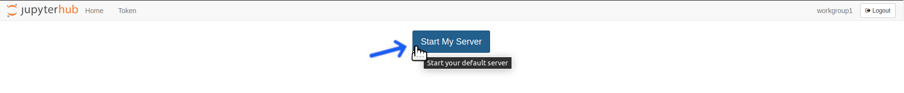
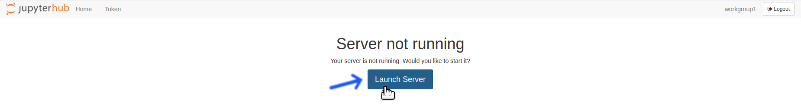
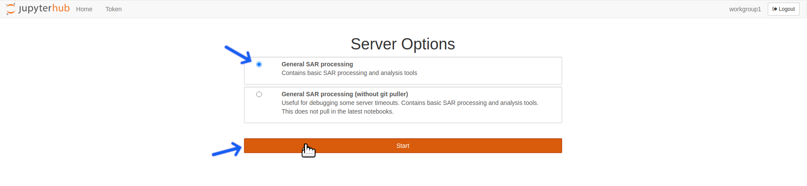
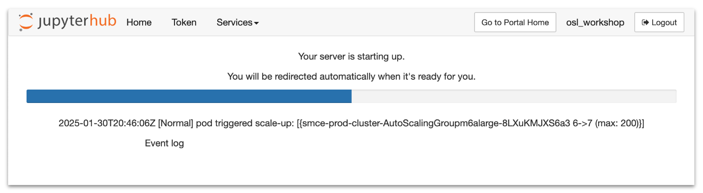
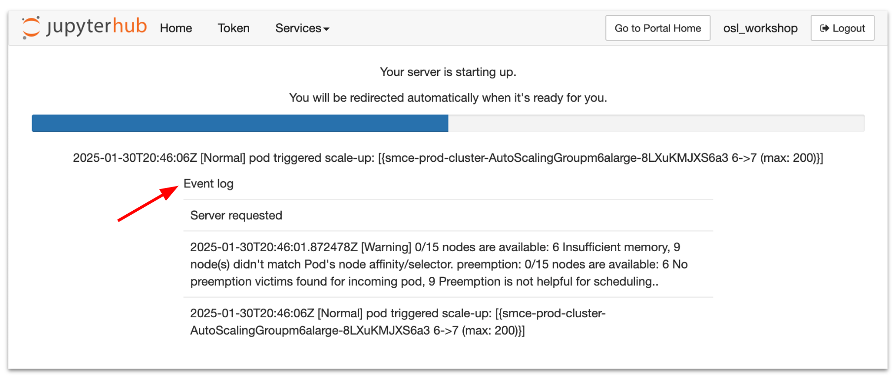
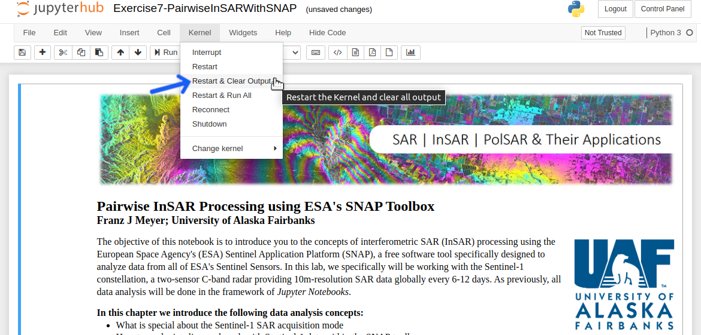

[Return to Table of Contents](../user.md)

# **Restarting the OpenSARlab Server and Notebook Kernel**

## **Restarting the OpenSARlab Server**

### Overview
---

Restarting the server triggers the `nbgitpuller`. 

Consider a case where:

- You have deleted or altered a notebook in the ASF notebook library and want to retrieve the original.
- There is a notebook update that you wish to pull in changes from the [asf-jupyter-notebook repo](https://github.com/asfadmin/asf-jupyter-notebooks).

A quick solution in either of those cases is to restart your server to run the `nbgitpuller`. 

**NB**: If you are comfortable with _git_, you could do a `git pull` from 
[the terminal](OpenSARlab_terminal.md) or in a notebook instead. However, do not push your changes as it may interfere with the `nbgitpuller`

---

### Steps to Restart the Server

---

1. Select `Hub Control Panel` from the `File` menu

    

    **or**

    Click the `Shutdown and Logout Page` button in the upper right corner of the screen.

    

1. Click the `Stop My Server` Button

    
    
1. Click the `Start My Server` Button, which may take a few seconds to appear.

    

1. Click The `Launch Server` Button

    

1. Select a Server Profile and Click the `Start` button

    
    
1. Wait for the server to start; this may take some time.

    
    
1. *Optional:* Click The `Event Log` arrow for detailed startup status information. You may use this information to send a report to the admin if your server does not start.

    

---

## **Changing a Notebook Kernel**

### Overview

---

Notebooks in OpenScienceLab run in a variety of [conda](https://docs.conda.io/en/latest/) environments. Since each kernel has different packages, you must pick the right one to confirm it has the required packages.

### How to Switch Kernel

---

1. Click the upper right corner. It should have the name of the `kernel` that you are currently using.
2. A window with a list of built `kernel` will pop up. Select whichever `kernel` you need.

    

**NB**: To build a `kernel`, refer to the [conda environments](./conda_environments.md) section.

---

## **Restarting a Jupyter Notebook Kernel**

### Overview
---

- As you run code cells in a notebook, initialized variables and their assigned values are stored in memory. If you decide to start over and re-run a previously ran notebook without restarting the kernel, you may encounter some issues. 

- The issues are caused by previously defined variables that persist in your memory. This is problematic for various reasons, such as:

     - They use up instance's limited memory resources.
     - Increase file size of notebook.
     - Previously defined values may cause unintended results when re-runing the code.

- *Example of unintended results:* Consider a notebook that builds a string, which starts empty and appends substrings systematically. When re-running this notebook, the string will no longer start empty and the resultant string will contain an unintended substring at its start.

The solution for this is to restart the kernel to clear notebook data that are stored in memory.

#### How?

1. Select `Restart`, `Restart & Clear Output`, or `Restart & Run All` From The Kernel Menu
    - `Restart` will restart the kernel but leave old code cell output in place.
    - `Restart & Clear Output` restarts the kernel and removes old code cell output. **This is generally the preferred option.**
    - `Restart & Run All` restarts the kernel and runs all the code cells. **This only works if the notebook does not require input from user.**

    
    
    *For most use cases, select `Restart & Clear Output`*

