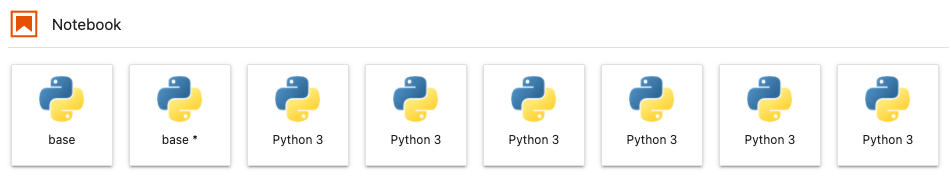
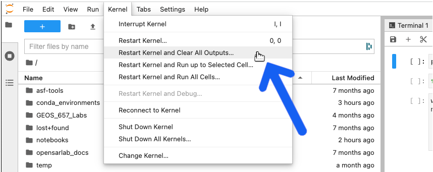
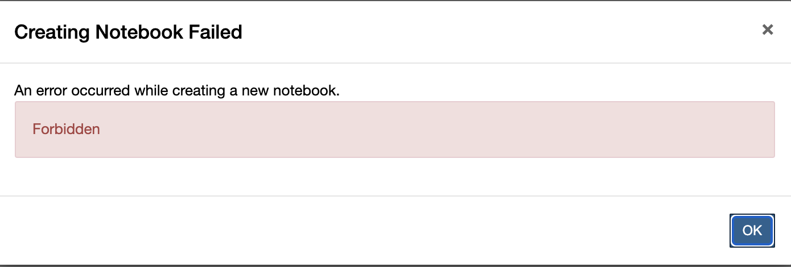

[Return to Table of Contents](../user.md)

# Troubleshooting Guide

## Why did the kernel die while running a notebook?


*The message that appears when a notebook kernel dies*


- The kernel will die if you run out of available memory to complete a running process. This occurs frequently when running a time-series or change detection algorithm on data stack that is either too deep or covers too large of an area-of-interest (AOI) for OpenSARlab to handle.
 
- Try running the notebook on some combination of a shallower data stack and/or a smaller AOI. This may take some experimentation because memory is shared among users, *i.e.* amount of available memory fluctuates. 

- To work with a deep stack covering an extensive AOI, you may need to tile up your data for the analysis and mosaic them later. 

*Summary:* If you are running a resource hungry program, your kernel might die. Try subsetting your data, processing it in batches, and mosaicing your results.

--- 

## I successfully ran a notebook earlier on the same data but now it is killing the kernel.

- OpenSARlab EC2 instances are shared among 1~3 users. The memory available to each user depends on overall activity on the EC2. It is likely that there was enough memory available for your process before, but not enough memory during later attempt(s). More details on the OpenSARlab user environment can be found [here](OpenSARlab_environment.md).

---

## When I open a notebook, I receive "Kernel not found" message.


*The message that appears when a notebook kernel cannot be found*
 
- You either have:
  - Not created the required conda environment yet
  - A mix-up between the environment name and prefix

- If you think you already installed the environment, select it from the pull-down menu that appears and click the `Set Kernel` button. 
 
- If you have not created the environment yet, use the following notebook: ```/home/jovyan/conda_environments/Create_OSL_Conda_Environments.ipynb```

---

## I see one or many `Python 3` or `Python` kernels instead of kernels named after conda environments that I expect to see. 



- The default display names for conda environment kernels are `Python 3` or `Python` (depending on when and how they were created).
- We use the kernda package to change a kernel's display name to that of the environment name.
    - There is code in the Create_OSL_Conda_Environments.ipynb notebook that does this.
    - If you have created an environment without using the Create_OSL_Conda_Environments.ipynb notebook, run the following command in a terminal to change its display name: `mamba run -n <environment name> kernda --display-name <environment name> -o <environment directory>/share/jupyter/kernels/python3/kernel.json`
    - Note: it is important to only run the above kernda command once.
        - Running it more than once will create a malformed `kernel.json`.
        - If you accidentally run it more than once, recreate the environment and try again.

---

## My notebook won't open, opens slowly, or won't save

- These are all signs that the notebook contains a lot of output and is too large to easily open or save over the internet in OpenSARlab.
    - If the notebook won't open or opens very slowly, remove its output by running the following command from a terminal:
        - `jupyter nbconvert --clear-output --inplace my_notebook.ipynb`
    - If the notebook is open and you can't save it, select `Restart Kernel and Clear All Outputs` from the `Kernel` menu and try saving it again.

    

---

## I tried to create a new notebook and recieved the error `Forbidden`



- This can happen when you have logged out of OpenSARlab and then try to create a new notebook from an OpenSARlab browser tab that was left open.
- You must log back in before you can create, open, or run a notebook.

---

## I am receiving a `No space left on device` error.

OpenSARlab users have access to a finite amount of storage space ([details here](OpenSARlab_environment.md)). 

**It is up to users to manage their storage**. 

- If you receive a storage space warning while logged into OpenSARlab, it is highly recommended to free up your space immediately by deleting unnecessary files. If your server shuts down without any available space, it will not have enough space on your volume to restart again and you will be locked out of your account.

- If you do get locked out from your account, contact an [OpenSARlab administrator](mailto:uaf-jupyterhub-asf@alaska.edu) for help. They will assign enough extra storage to your server so that you can login and delete unnecessary files.

- If you do not have any files that you can delete and feel that you really do need additional space to do your work, contact an [OpenSARlab administrator](mailto:uaf-jupyterhub-asf@alaska.edu) and request more storage space. 

  - **Limits will only be increased if there is a demonstrable need.**

---

## My server won't start and I cannot access OpenSARlab.

This issue is typically due to an unexpected behavior of the [nbgitpuller](https://jupyterhub.github.io/nbgitpuller/).

- Click the `Event log` arrow beneath the server startup progress bar to view the details of any nbgitpuller conflicts.


*Click the `Event log` arrow beneath the server startup progress bar.*

- If the problem is:
 
  - Related to `nbgitpuller`, you will find details regarding to which file(s) are causing the conflict in the event log. 
In such cases, note the names and locations of the offending file(s) and logout of OpenSARlab.

  - Not related to the `nbgitpuller`, contact an [OpenSARlab Administrator](mailto:uaf-jupyterhub-asf@alaska.edu).


*Click the `logout` button located on top right corner of the screen*
  
- After logging out, the startup screen will reload. Select the `General SAR processing (without git puller)` server option and click the `Start` button. 
 
 

 *Select the `General SAR processing (without git puller)` server option and click the `Start` button*
 
- The server should now load and you will have access to your account. Go to where the conflicting file(s) are located. There are three options for dealing with each of the offending file(s):
 
   1. Delete the file(s) if there are no changes from the original ones that you wish to save. 
   1. Rename the file(s) if there are changes you wish to save.
   1. If you wish to try again using nbgitpuller, update the file's timestamp. You can do so by opening the [terminal](OpenSARlab_terminal.md) and run `touch /your_path_1/.../your_path_n/file_name`.

- Once you are done with one of the above operations, logout of OpenSARlab.
 
 

 *Click the `logout` button located at the top right corner of the screen*
 
- Log back in and select `General SAR processing` server option.
 
 

 *Select the `General SAR processing` option and click `Start`*

- Upon completing above tasks, you should notice that:

  1. The nbgitpuller runs successfully. 
  1. Server starts up properly.
  1. You are receiving updates from the [ASF notebook library](https://github.com/asfadmin/asf-jupyter-notebooks).

---

## The edits I made to an ASF notebook have disappeared since the last time I used OpenSARlab.

- When your OpenSARlab server starts up, `nbgitpuller` will run and pull in any updates made to the [ASF notebook library](https://github.com/asfadmin/asf-jupyter-notebooks). If a change has been made to a notebook by both the user and ASF, both changes will be saved. The ASF version will retain its original name while the user's version will have a timestamp appended to its name. 

- *Example file format:*  

```
ASF Edit: sample_notebook.ipynb
User Edit: sample_notebook_20210616165846.ipynb
```

- If you feel like your notebook is missing, it is likely in its original location with a recent timestamp appended to its name.

---

## One of my notebooks looks like it has a mix of code from various versions of the notebook.

- We have seen this happen occasionally and it is due to a issues with [nbgitpuller](https://jupyterhub.github.io/nbgitpuller/). The best option is to delete the notebook and [restart your OpenSARlab server](restarting_server_and_kernel.md). The notebook will be replaced with a fresh copy from the [ASF notebook library](https://github.com/asfadmin/asf-jupyter-notebooks).

---

## I know there was an update made to an ASF notebook but I still have the old version.

- We have seen this happen occasionally and it is due to [nbgitpuller](https://jupyterhub.github.io/nbgitpuller/). The best option is to delete the outdated version of the notebook and [restart your OpenSARlab server](restarting_server_and_kernel.md). The notebook will be replaced with a fresh copy from the [ASF notebook library](https://github.com/asfadmin/asf-jupyter-notebooks).

---

## I am having trouble setting up a web server and developing my web app in OpenSARlab.

- This cannot be done in OpenSARlab. You will need to do this elsewhere.

---

## A notebook won't load. A new browser tab opens and shows the JupyterHub header, but no notebook appears. 

- This is due to slow loading time caused by a large notebook. 

- If you run a notebook and close it without clearing all output from the code cells, the file size will increase. While the notebook may eventually load, you will need to reload your browser window if it times out. 

- *Example: A 40KB notebook can grow to over 60MB if you don't clear its output.* 

---

## I tried to run a notebook that downloads products from HyP3 and I get an error

- HyP3v1 (HyP3 beta) has been retired and replaced with an updated [HyP3 API and SDK](https://hyp3-docs.asf.alaska.edu/).
- Notebooks using the old version of HyP3 **will be removed from the [ASF Jupyter Notebook library](https://github.com/ASFOpenSARlab/opensarlab-notebooks) in GitHub on September 30th 2021.** 
  - While old notebooks will be removed from GitHub, they will not be deleted from user storage on your OpenSARlab account. If you wish, you may delete them yourself to avoid confusion. 
- Once you have switched to using the new version of HyP3, you should start using HyP3 notebooks that include "v2" in their filenames.
  - *Example*: Stop using `Prepare_Data_Stack_HyP3.ipynb` and start using `Prepare_Data_Stack_HyP3_v2.ipynb` 

---

## My issue is not on this list

- Please contact an [OpenSARlab administrator](mailto:uaf-jupyterhub-asf@alaska.edu) for help.

<!-- TODO: add documentation in regards to server timeouts -->
