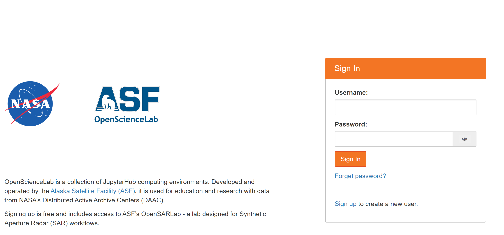
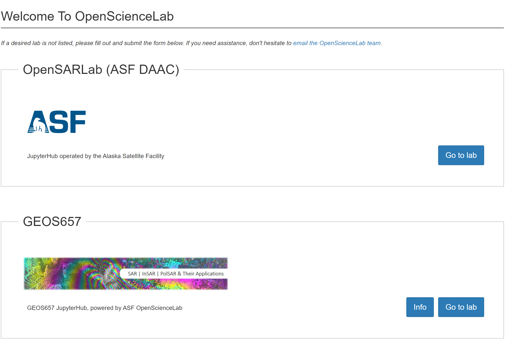
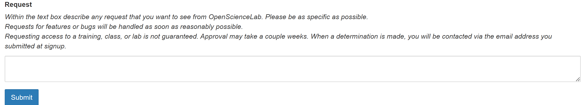
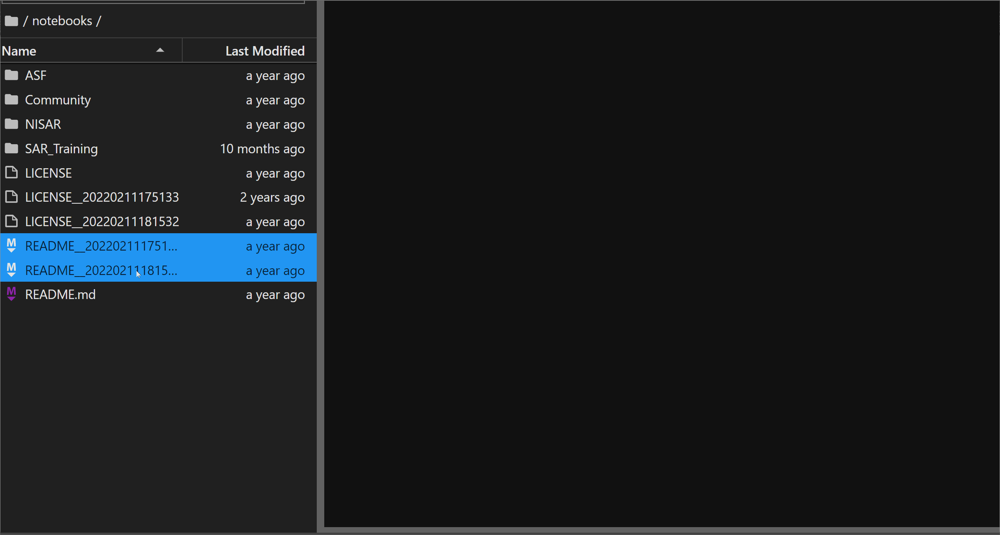
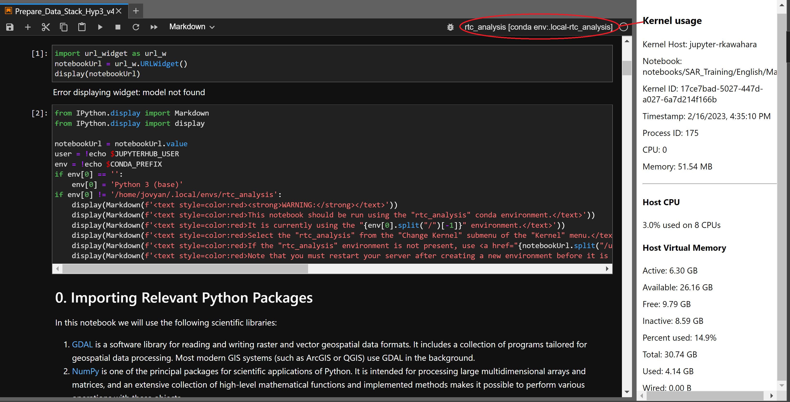

# February 2023

Welcome to the February 2023 OpenScienceLab Update!

### Changes:
- [OpenScienceLab](opensciencelab)
- [Single Sign On](single-sign-on)
- [Automatic Authentication](automatic-authentication)
- [User Access](user-access)
- [IP Filter](ip-filter)
- [User Request](user-resquest)
- [Multi Download](multi-download)
- [Kernel Usage](kernel-usage)
- [Recommended Jupyter Notebook Changes](recommended-jupyter-notebook-changes)

---

(opensciencelab)=
## **OpenScienceLab**

- OpenSARLab is now a part of OpenScienceLab with significant changes. Users can access different courses from a single page.



(single-sign-on)=
## **Single Sign On**

- New single sign-on (SSO) to simplify the logging-in process. SSO eliminates the burden of the sign-on process by listing all accounts on a single web page with additional layers of security.



(automatic-authentication)=
## **Automatic Authentication**
- Users who sign up to the OpenScienceLab no longer need admins to activate their accounts.

(user-access)=
## **User Access**
- Admins can easily give users access to different profiles from a single page. Admins can toggle access lists based on various deployments.

(ip-filter)=
## **IP Filter**

- OpenScienceLab will prevent users in one of NASA’s [designated countries list](https://www.nasa.gov/sites/default/files/atoms/files/designated_country_list_6.10.2022.pdf) from creating an account so that we are compliant with NASA’s security protocol.

(user-resquest)=
## **User Request**
- Users can send a request to the OpenScienceLab team from the portal. 



(multi-download)=
## **Multi Download**
- Users can download multiple files at once through OpenScienceLab.
- **NB**: Downloading multiple directories requires users to compress the directories beforehand.



(kernel-usage)=
## **Kernel Usage**
- The latest update of JupyterLab has a built-in kernel monitor that tracks detailed resource usage, such as:
  - Kernel Host
  - Memory consumption and availability
  - CPU usage




(recommended-jupyter-notebook-changes)=
## **Recommended Jupyter Notebook Changes**

The following bullet points cover code changes you may need to make to your notebooks for them to work in JupyterLab:

- MintPy Update:

    Due to the recent MintPy update, import syntax for version 1.4.1+ differs from previous versions. As a result, some notebooks may be incompatible with the latest version of MintPy. Below are examples of how to import MintPy depending on which versions you have:

    ``` python
    # version 1.4.0 and below:
    import mintpy.view as view
    import mintpy.tsview as tsview
    .
    .
    .
    
    # version 1.4.1+
    from mintpy.cli import view, tsview, ...        
    ```

For additional backward compatibility changes, please refer to the previous release notes.
