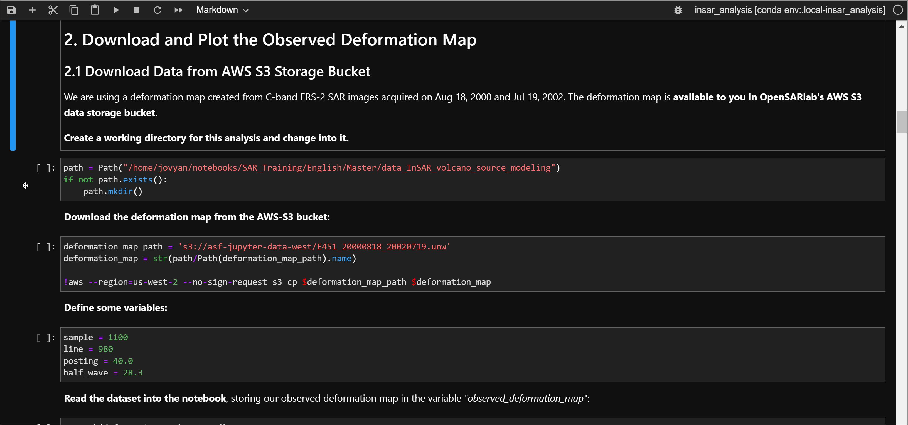
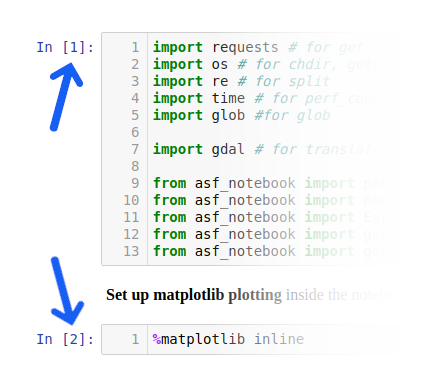
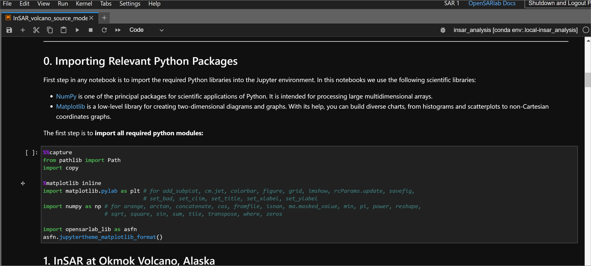
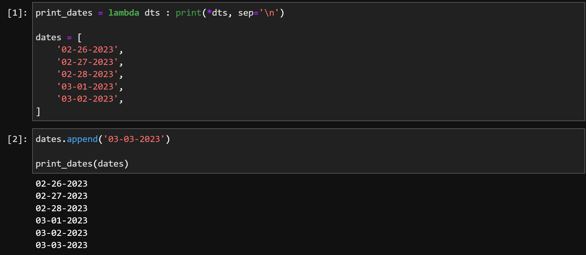
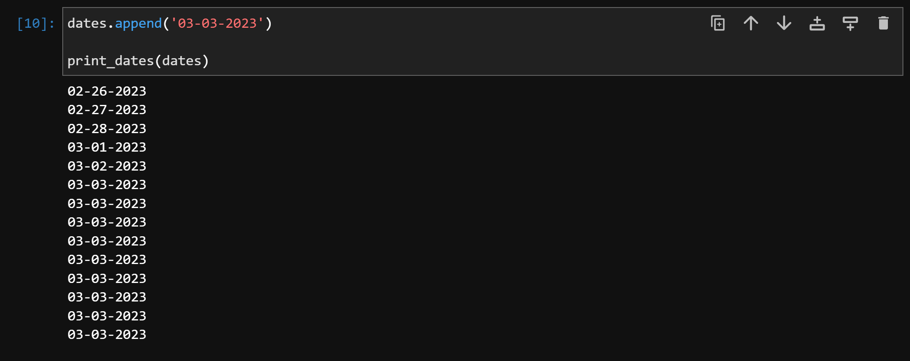

# Running Jupyter Notebooks
- [A Light Introduction to Jupyter Notebook](#a-light-introduction-to-jupyter-notebook)
    - [Markdown Cells](#markdown-cells)
    - [Code Cells](#code-cells)
- [Detailed Instructions on Running Jupyter Notebook](#detailed-instructions-on-running-jupyter-notebook)
    - [Selecting Cells](#selecting-cells)
        - [Edit Mode vs Non-Edit Mode](#edit-mode-vs-non-edit-mode)
        - [Select Individual Cell (Non-Edit Mode)](#select-individual-cell-non-edit-mode)
        - [Select Multiple Cells (Non-Edit Mode)](#select-multiple-cells-non-edit-mode)
        - [Select Cell (Edit Mode)](#select-cell-edit-mode)
        - [Select a Markdown Cell (Edit Mode)](#select-a-markdown-cell-edit-mode)
    - [Hiding a Cell](#hiding-a-cell)
        - [Hiding via Code Cells](#hiding-via-code-cells)
    - [Running Cells](#running-cells)
        - [Run a Single Cell](#run-a-single-cell)
        - [Run Multiple Cells](#run-multiple-cells)
        - [Rerunning a Notebook](#rerunning-a-notebook)
    - [Clearing Cell Output Before Closing](#clearing-cell-output-before-closing)
- [Summary and Demo]()

---

# A Light Introduction to Jupyter Notebook
[Jupyter Notebook](https://jupyter.org/) is a web application that allows users to display: 

* Interactive and runnable code cells, typically written in [Python](https://docs.python.org/3/)
* [Markdown](https://jupyter-notebook.readthedocs.io/en/stable/examples/Notebook/Working%20With%20Markdown%20Cells.html) cells containing explanatory text, formulas, hyperlinks, tables, pseudocode, images, etc.

Jupyter Notebook provides an ideal format for teaching/learning coding concepts, prototyping algorithms, and collaborating on Python projects. 

While Jupyter Notebook has four cell types, we use the following two for the OpenSciencelab:

## _Markdown Cells_

Markdown cells contain documentation in Markdown, HTML, and/or LaTeX. They are often used to display text, images, hyperlinks, formulas, tables, pseudocode, plots, figures, etc. 

- To enter edit mode in a markdown cell, double-click the cell.

  

_A markdown cell in edit mode_

If you wish to proceed through the notebook past the markdown cell or run a markdown cell's code to display its formatted contents, you can:
- Click the **play** button at the top of the notebook
- Use the `shift + enter` shortcut key.

 

*A run markdown cell*

**NB**: The cell will automatically move to the next cell if you are using the **play** button to run the cell.

## _Code Cells_

Code cells contain editable and runnable Python code. You can run them in any order for any number of times.
 
 

*A code cell*

**NB**: While the ability to rerun the code cells in arbitrary order can be helpful, it can cause unexpected problems, such as:
- Recycled variables may contain unexpected values if you run cells in non-sequential order.
- Values from previous cells may trigger a different behavior when running the same cell.

---

# Detailed Instructions on Running Jupyter Notebook

Now that users have a basic understandings of Jupyter notebook, users can use below manual as a refernce for detailed use.

## **Selecting Cells**

Users may select cells individually or in a batch; users can then run the selected cells.

### **Edit Mode vs Non-Edit Mode**
Before we discuss cell selection, it may be helpful to learn the difference between the _edit_ mode and _non-edit_ mode.

- **Edit Mode**: If you select a cell using edit mode, you may edit the code and Markdown written on that cell. You can choose the cell in the _edit_ mode by clicking inside the cell box.

- **Non-Edit Mode**: If you select the cell outside of the code/Markdown box, you will be selecting the cell in a _non-edit_ mode.

While the difference is subtle, it is crucial to know the different modes because some hotkeys are unavailable in the _edit_ mode. For instance, the `shift + j` command will allow you to select multiple cells in the _non-edit_ mode, but this does not work in the _edit_ mode.

---

### **Select Individual Cell (Non-Edit Mode)**
- Click on the left side of the cell.

A selected cell displays a blue horizontal line on the left edge. Markdown cell will have an additional shaded area that is directly next to the cell. For a visual example, please refer to the _hiding cells_ section.

**NB**: It is crucial to **avoid clicking** the _blue_ edge as well as the shaded area that is directly next to the cell. We will discuss this in a later section.

---
 
### **Select Multiple Cells (Non-Edit Mode)**
1. Select a cell in non-edit mode
1. Select multiple cells with:
    - `shift + j` or `shift + Down-Arrow` to select additional cells below
    - `shift + k` or `shift + Up-Arrow` to select additional cells above
1. Perform batch operations on selected cells with **play** button or with `ctrl + enter`.

*Selected cells will have a blue background*

---

### **Select Cell (Edit Mode)**
- Click inside a cell block.

 

For live demonstration, please refer to the [_code cells_](#code-cells) section.

**NB**: The edit mode cell will no longer display green edges.

---
 
### **Select a Markdown Cell (Edit Mode)**
- Double click inside a cell.

 

For live demonstration, please refer to the [_Markdown cells_](#markdown-cells) section.

**NB**: The edit mode cell will no longer display green edges.

---

## **Hiding a Cell**

Sometimes, having too many cells may feel cumbersome. Below are the ways to hide the cells:

### **Hiding Individual Cell**

You can hide an individual code cell by clicking the blue vertical line on the left of the code cell. 

### **Hiding Multiple Cells**

Alternatively, you may click the dark-shaded are on left of the Markdown cells to hide all proceeding cells.

---
 
## **Running Cells**
Because you can run code cells in any order, each cell generates a number in the order they ran.

---

### **Run a Single Cell**
#### With the Run Button
1. Select any cell you wish to run. 
1. Do one of the following:
    - Click `Run` button
    - `Ctrl + Enter` to run a cell
    - `Shift + Enter` to runs a cell and selects the cell below
    - `Alt + Enter` to runs a cell and inserts an empty cell below

*Running selected cell multiple times with `ctrl + enter`*

---

### **Run Multiple Cells**

Instead of running just a single cell, you can run multiple cells at once in a following manner:

- Run every cell above/below selected cell.
- Run them in a groups of selected cell.
- Run the entire notebook

#### **Running every cell above/below:**

Select a cell, then:

- Select `Run All Above Selected Cell` from the _Run_ menu
- or select `Run Selected Cell and All Below` from the _Run_ menu

*Running all cells above selected. Note that the selected cell is ignored.*

#### **Run a batch of selected cells**
Select a group of cells, then:
    - Use a hotkey
    - or click the run button

*Runs a group of cells in a batch using `ctrl + enter`*
    
#### **Run an Entire Notebook**

If you wish to run the entire notebook from the get-go, you can do one of the following:

- Select `_Run_` > `_Run All Cells_`
- Select `_Run_` > `_Restart Kernel and Run All Cells..._`

The difference is that the former option preserves the values from the previous run while the latter lets you run from a new state—more on this in the next section.

---

### **Rerunning a Notebook**
We recommend restarting the notebook kernel before rerunning it since any initialized variables and data structures from a previous run persist in memory along with their values, which can lead to unintended results.

_For instance, consider the following case_:

Assume you have a Python list with date-specific data, such as weather, stock prices, etc. If you were to run a cell that appends data from a specific date multiple times, it may yield unpredictable results due to the duplicate data. 

*e.g.* 

_In the above example, running the second cell once will append a new date at the end of the list._

_However, running the same cell will keep appending the same value._

Rerunning previous cells can cause unexpected behavior. We recommend restarting the notebook when you are running from the beginning.

To restart the notebook, select any of the `Restart` options from the Kernel Menu.

---

## **Clearing Cell Output Before Closing**
We recommend clearing every output from each code cell before closing or saving a notebook. Leaving the output in place can increase the file size of the notebook, which will use up more of your volume and cause slower notebook loading times (especially if you have a slow internet connection).
