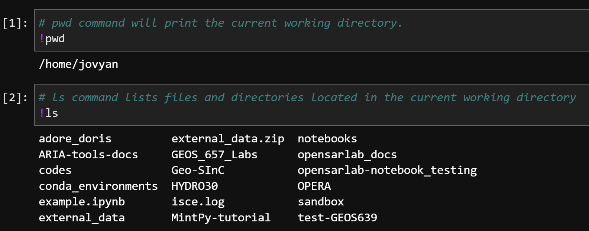

# Jupyter Magic Commands

In addition to running Python code, Jupyter Notebooks allows users to run [magic commands](https://ipython.readthedocs.io/en/stable/interactive/magics.html) with various functionality. 

---

## **Shell Assignment Syntax** 

In IPython syntax, the exclamation mark (!) allows users to run shell commands from inside a Jupyter Notebook code cell.

Simply start a line of code with `!` and it will run the command in a shell, using the Conda environment of the currently running Python kernel. 

*Example:* 

---

## **Line Magics**

A line magics starts with a single `%` sign and affects only the line where `%` is used. 

### 1. `%matplotlib inline`
- Allows **non-interactive** `matplotlib plots` to be displayed in a notebook.

*Example*: 

### 2. `%matplotlib widget`
- Allows **interactive** `matplotlib plots` to be displayed and interacted with inside a Jupyter Notebook. 

*Example*:

### 3. `%time`
- Time the execution of a Python expression.

### 4. Find information on many more line magics [here](https://ipython.readthedocs.io/en/stable/interactive/magics.html#:~:text=IPython%20trove%20classifier.-,Line%20magics,-%EF%83%81).

---

## **Cell Magics**

Cell magics start with `%%` and affect the contents of an entire cell. 

### 1. `%%javascript` (or `%%js`)
- Runs a JavaScript code cell. 

*Note: leave a blank line above the magic command in the beginning of the code cell.*

*Example*:

### 2. `%%capture`
- Runs the cell but captures all output. We typically use this to suppress the output of a `%matplotlib plot` that the user does not wish to see. 

### 3. Find information on many more cell magics [here](https://ipython.readthedocs.io/en/stable/interactive/magics.html#cell-magics:~:text=True%20value%20set.-,Cell%20magics,-%EF%83%81)
