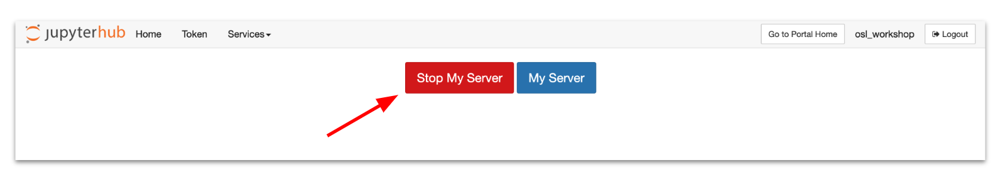

# Server Logout/Shutdown Best Practices

When you are ready to stop working in OpenScienceLab, please shut down
your server and logout.

Shutting down your server is the same as shutting down your computer. If you
shut down your server and come back the next day (or even the next week), all
your files will still be there and you can resume processing your data.

- Logging out will **not** shut down the server on its own. While the server may
shut down automatically after an hour of inactivity, users should not rely on
this feature.

- The server will stay alive while there are any notebooks open in active
browser tabs.

---

## Why Shut Down the Server?

Do your part to reduce resource use and ease the burden on the environment by
shutting down your server when you are finished working for the day.

Additionally, while OpenScienceLab is and will remain free to our users, resources
used do incur costs, which are paid for by the Alaska Satellite Facility. Help us
keep OpenScienceLab free by shutting down servers when they are not in use.

**In some instances, you may need to leave your server running. For example, you
have a notebook performing a very time intensive analysis and wish to let it run
overnight. It is acceptable for you to keep your server running in cases like this.**

*Summary: Unless you intend to run your server for a long period of time, make
sure to shut it down before you leave.*

---

## How to Shut Down The Server and Logout in Jupyter Lab

1. **Select `Hub Control Panel` from the `File` menu**

    

    **or**

    **Click the `Shutdown and Logout Page` button in the upper right corner of
    the screen**

    

1. **Click The Stop My Server Button**

    

    *Click the **Stop My Server** button that appears.*

1. **Click The Logout Button**

    

    *Click the **Logout** button.*

---

## How to Shut Down The Server and Logout in Jupyter Notebook

1. **Click The Control Panel Button**

    

    *Click the **Control Panel** button at the top right corner of the file manager
    or in an open notebook.*

1. **Click The Stop My Server Button**

    

    *Click the **Stop My Server** button that appears.*

1. **Click The Logout Button**

    

    *Click the **Logout** button.*
