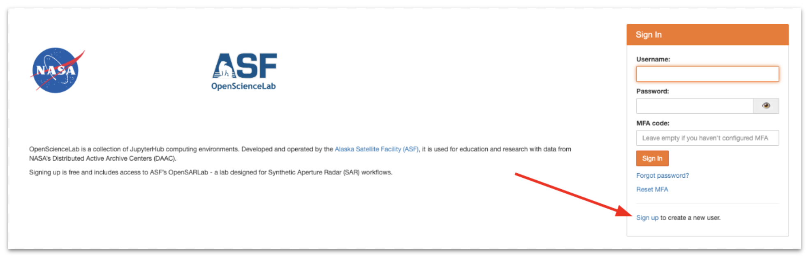
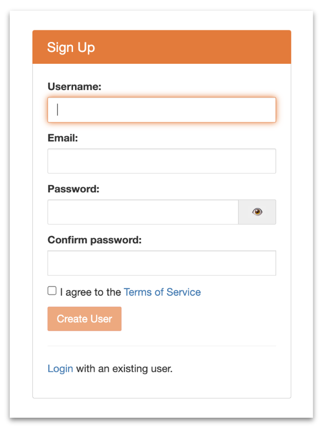
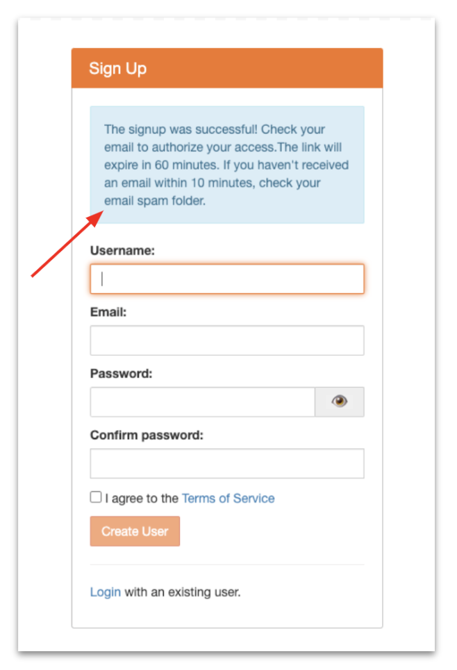
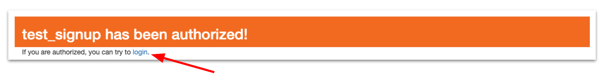

# OpenScienceLab Accounts

OpenScienceLab is a single-sign-on portal providing access to ASF-managed JupyterHubs such as OpenSARLab. OpenScienceLab hosts labs for research projects, classes, and workshops. If you are attending a class or workshop, your instructor will provide details for gaining access to the lab.  

ASF provides limited access to OpenSARLab. NASA-affiliates are granted access upon request. All others may apply for access by completing the [OpenSARLab Access Application](https://forms.gle/LNBCwe8JohYitvfy6).

Labs in OpenScienceLab are independent. If you have access to multiple labs, each will have its own storage volume and you cannot copy data directly from one to another. 

Be mindful to use the correct lab for a given event. They are configured to support expected workflows.  

## Sign Up for an OpenScienceLab Account

**Whether accessing OpenSARLab, a class/workshop lab, or any other ASF-hosted lab, you will need an OpenScienceLab account**

1. Open a web browser and navigate to https://opensciencelab.asf.alaska.edu/
2. Click the “Sign up” link in the “Sign In” window

3. Complete the Sign Up form

5. A message will appear, indicating that your account was created and that email authorization is required. Locate the email and click the link within 60 minutes. If you don't click the link in time, you can start the sign up process over with a different username or contact OpenScienceLab admin and request a reset so you can try again with the same username.

6. The authorization link will open to a message indicating successful account authorization. You can click the include link to login.

7. Do not provide an MFA code the first time you login; leave the field blank. You will be required to setup MFA after signing in the first time in order to access any labs. [MFA setup instructions](./mfa.md#troubleshooting).