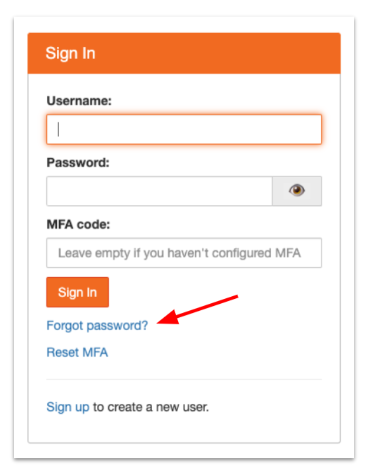
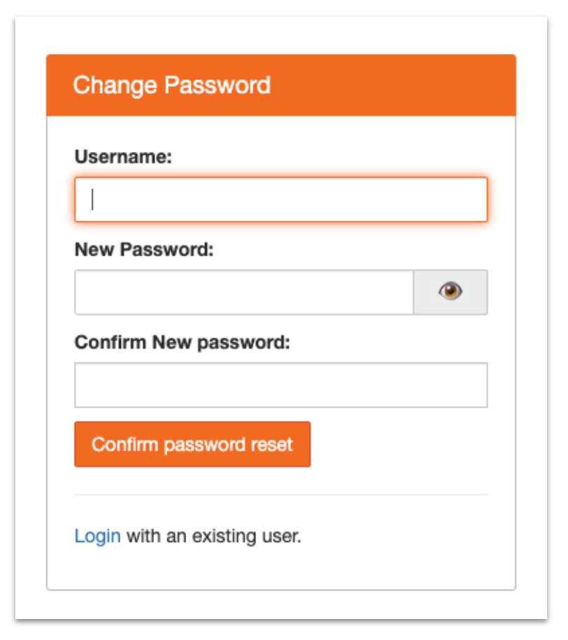
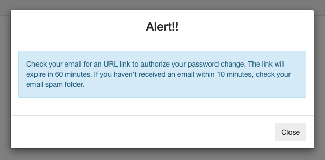
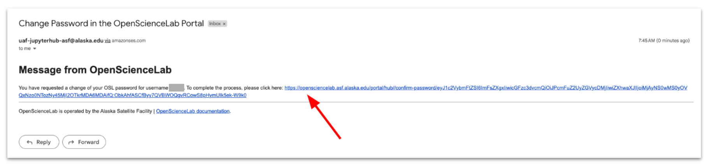

# Resetting Your OpenScienceLab Password

1. Navigate to [https://opensciencelab.asf.alaska.edu/](https://opensciencelab.asf.alaska.edu/) and click the "Forgot password?" link on the sign in section.

2. Complete and submit the Change Password form.

3. An alert will appear directing you to click the emailed verification link within 60 minutes.

4. Open the email and click the verification link.

5. Log into OpenScienceLab with your new credentials.