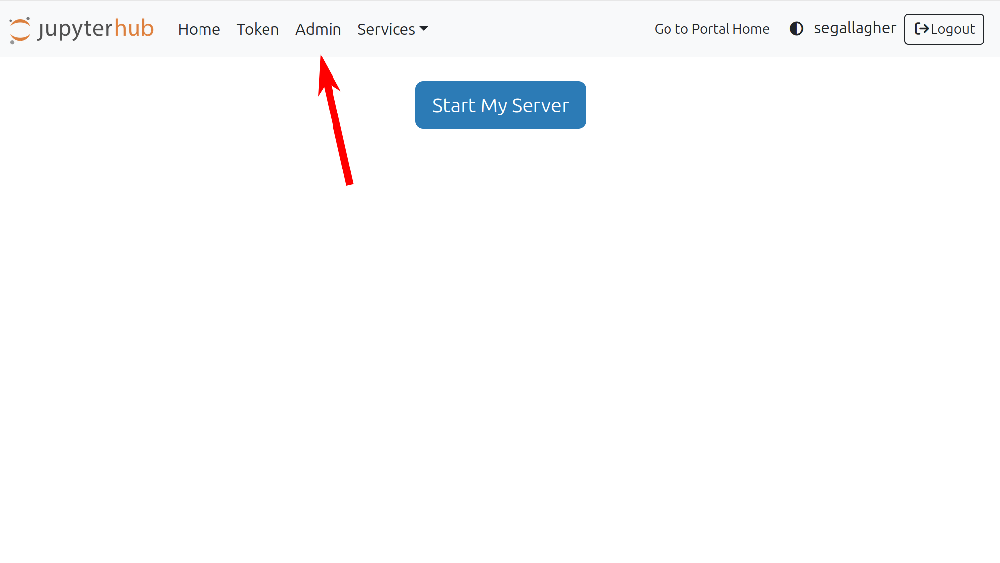
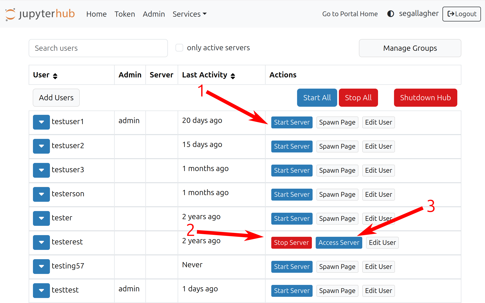

# Lab Management
 

## What Can a Lab Manager Do

A lab manager has all admin permissions for a particular lab:

- Add and remove users from the lab
- Manage a users allowed profiles
- Grant and remove Lab Manager permissions
- Generate and revoke tokens
- Administrate users servers and permissions via their lab's JupyterHub interface

## Lab Manager Page

### Accessing Management Page

In OpenScienceLab, there will be a new `Manage` button on the lab card you have lab manager permissions for.

<figure>

</figure>

### Tokens

If the lab does not have tokens enabled you will see a message in the `Tokens` section indicating as such.

<figure>

</figure>

If the lab has tokens enabled, you will see the following user interface

<figure>

</figure>

#### Creating Token

1. Lab profiles field: A comma separated list of profiles a user who uses this token will have access to, for example: `m6a.large, m6a.xlarge`. By default the field will be pre-populated with the lab's default set of profiles.

1. Date range fields: Optional fields that allow you to set a start and/or end date for when your tokens are valid.

1. Add button: Generates a random token with your provided token settings.

#### Token Options

4. Token, a random 13 character long token. Share this with your users to allow them to join your lab with a token.

1. Token settings. Displays the settings the token was generated with. These cannot be changed after creation.

1. Remove token button. Allows you to invalidate a token, making people unable to get access to your lab with it.

### User Management

In the `Users` portion of the page, you will see a list of users with access to the lab and their permissions.

<figure>

</figure>

#### Adding/Updating Users

1. Username field, this must match the username of the user you are trying to add. The user does not need to have an account made at this point, but the next user who creates an account with that username will have access to the lab.

1. Lab profiles field, a comma separated list of profiles the user should have access to. Ex: `m6a.large, m6a.xlarge`. By default the field will be prepopulated with the labs default set of profiles.

1. Add button: Adds a user to the lab with the requested set of profiles. If the user was already added to the lab, it will overwrite their previous profiles with the provided profiles.

#### Filtering Users

4. If your lab has a large amount of users, the amount displayed will be truncated. You can filter users by username or email. After typing your filter, press enter to apply it.

#### Managing Permissions

5. Users available profiles: If the profile is green the user has access to that profile, if the profile is red the user does not have access to that profile. In order to update the users allowed profiles you must re-add the user with the new labs. You do not need to remove the user before re-adding them.

1. Remove button: Pressing this button will remove the user from the lab.

1. Lab manager permission button, if the user is not a lab manager you will be able to grant manager permissions. If the user is a lab manager you will be able to remove their lab manager permissions here.

## Lab Management in JupyterHub

In the JupyterHub interface, lab managers will have access to the `Admin` tab in the navigation bar. You can reach the JupyterHub interface by clicking the `Go to Lab` button in OpenScienceLab.

<figure>

</figure>

The JupyterHub admin interface has a lot of features, here are some of the most notable ones.

<figure>

</figure>

1. Start any users server with this button

1. Stop any users server

1. Access any users running server, useful for debugging.
