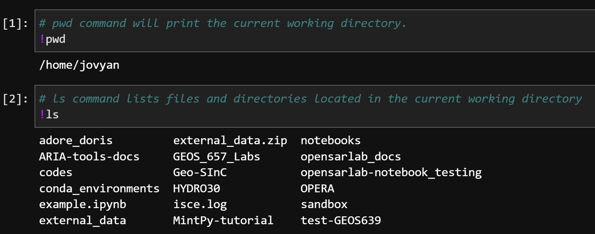
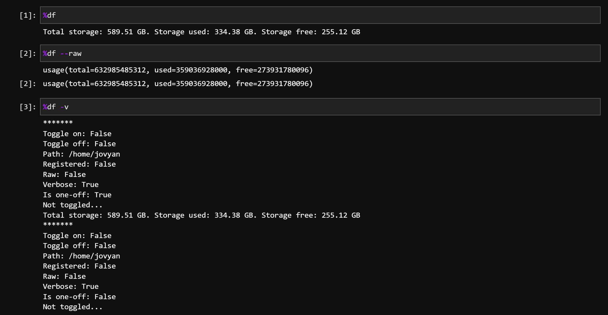
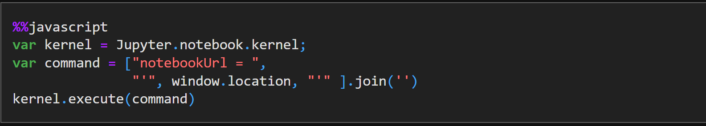
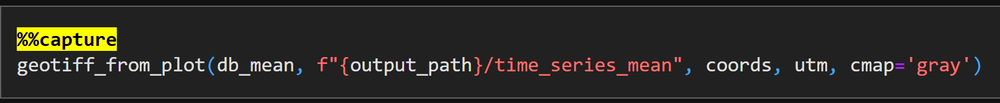

[Return to Table of Contents](../user.md)

# **Jupyter Line and Cell Magics, and IPython Syntax**

In addition to running Python code, Jupyter Notebooks allows users to run [magic commands](https://ipython.readthedocs.io/en/stable/interactive/magics.html) with various functionality. While all magic commands are available to users, the below magic commands are used the most in the OpenScienceLab:

- [Shell Assignment Syntax](#shell-assignment-syntax)
- [Line Magics](#line-magics)
- [Cell Magics](#cell-magics)

---

## **Shell Assignment Syntax** 

In IPython syntax, the exclamation mark (!) allows users to run shell commands from inside a Jupyter Notebook code cell.

Simply start a line of code with `!` and it will run the command in the shell. 

*Example:* 

---

## **Line Magics**

Line magics start with a single `%` sign and affect only the line where `%` is used. 

The following are the most frequently used line magics:

### `%matplotlib inline`
- Allows **non-interactive** `matplotlib plots` to be displayed in a notebook.

*Example*: 

### `%matplotlib widget`
- Allows **interactive** `matplotlib plots` to be displayed and interacted with inside a Jupyter Notebook. 

*Example*:

### `%df`
This is a custom magic written specifically for OpenScienceLab. It uses the Python function `shutil.disk_usage()` to check the storage state of the user's volumes. 

You may use the below flags to output results in a different manner:

- `%df` - Returns a human-readable string in GB.
- `%df --raw` - Returns a raw data object.
- `%df --on` - Returns a string in GB after running every subsequent code cell.
- `%df --off` - Turns off the `%df --on` option.
- `%df -v` - Prints additional debugging text.

*Example*:

### _Legacy Note_ 

Due to the new `url_widget` package, the user no longer needs to use the `%matplotlib notebook` and use the `%matplotlib widget` instead.

---

## **Cell Magics**

Cell magics start with `%%` and affect the contents of an entire cell. 

### `%%javascript` (or `%%js`)
- Runs a JavaScript code cell. 

*Note: leave a blank line above the magic command in the beginning of the code cell.*

*Example*:

### `%%capture`
- Runs the cell but captures all output. We typically use this to suppress the output of a `%matplotlib plot` that the user does not wish to see. 

