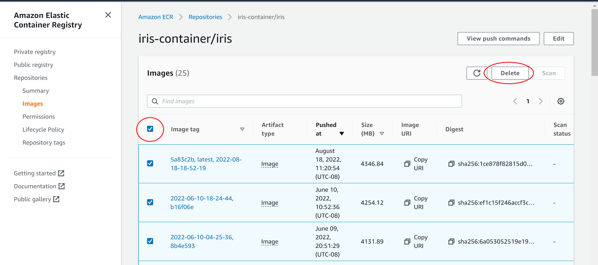
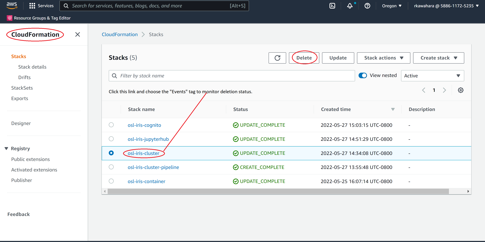
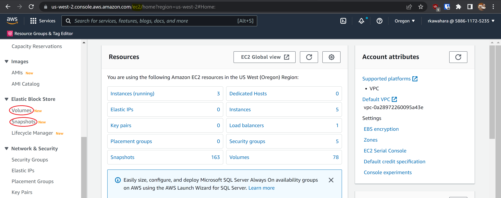
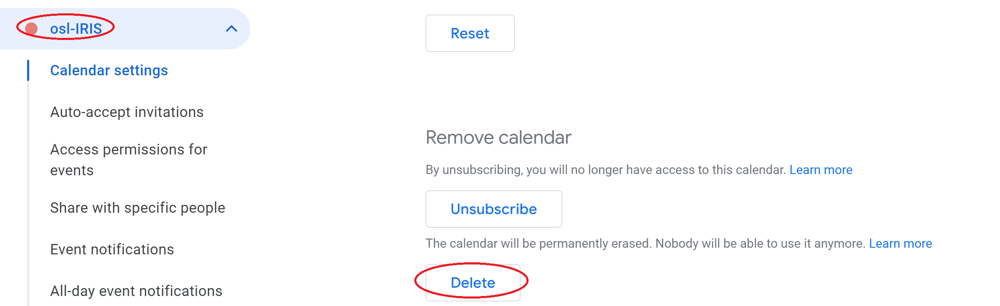

[Return to Developer Guide](../dev.md)

# **Destroy Deployments**

It is essential to destroy a deployment at the end of its life cycle so that no resources are left in place. With a proper destruction procedure, one can mitigate the accrued cost of AWS. 

---

## **WARNING:** Before deleting the deployments, developers will need to account for the following: 

- When deleting the `CloudFormation` stack, the deletion order matters.
- Delete some of the `CloudFormation` stacks before deleting ECR.
- The name of the items you're deleting may differ depending on the deployment you are taking down. For example, your deployment's `CloudFormation` stack may not have a `region` name.
- Do **NOT** take down the `CloudWatch` logs. These are used for statistical analysis later on.

---

## **Removing CloudFormation Stacks**

---

When you first go to CloudFormation, it should look something like the following:

Because the order of removing deployment is essential, you will need to take down the `CloudFormation` stacks first. Deleting the following CloudFormation stacks will kill the deployment and remove its resources:

- `<deployment_name>-container`
- `<deployment_name>-cluster`
- `deployment_name`

---

_**NB**_: **Do not manually delete any S3 buckets after emptying them** in the steps below.

If you delete the buckets after emptying them, the `CloudFormation` stack deletions associated with those buckets will fail. To fix the issues regarding deleted buckets, you will have to recreate the empty buckets to proceed. 

Therefore, let `CloudFormation` delete the S3 buckets for you once you empty them.

---

Follow the below instructions to properly delete these stacks.

---

## **Steps to Delete `CloudFormation` Stacks**

---

### **1. Prepare to delete the `<deployment_name>-container` CloudFormation stack**
    
_NB: The `<deployment_name>-container` is independent of other stacks, i.e., the deletion order does not matter._

1. Empty the `codepipeline-<region>-<deployment_name>-container` S3 bucket

2. Navigate to the AWS S3 console
    1. Click the `codepipeline-<region>-<deployment_name>-container` S3 bucket option.
    1. Click the `Empty` button
        1. Confirm the deletion of bucket contents by typing `permanently delete` in the provided field
        1. Click the `Empty` button

### **2. Delete ECR repos**

1. Navigate to the AWS Elastic Container Registry

2. Before deleting the ECR, you will need to empty them first.
    1. Click the repository name first and go to the individual ECR repository.
    1. Select all items by clicking the first box.
    1. Select `delete` and confirm the deletion.

3. Go back to the ECR Registry and click the option next to the empty `<deployment_name>/<profile_namespace>` repository
4. Click the `Delete` button
    1. Confirm the deletion by typing `delete` in the provided field
    1. Click the `Delete` button
5. Repeat for each profiles

### **3. Delete the `<deployment_name>-container` CloudFormation stack**
1. Navigate to the AWS CloudFormation console

1. Click the `<deployment_name>-container` stack option
1. Click the `Delete` button
    1. Click the `Delete Stack` button
1. Click the `<deployment_name>-container` stack name
    1. Click the `Events` tab
    1. Monitor the stack deletion progress
        1. Click the refresh button periodically since the console doesn't update events automatically

_NB: Stack deletion process will be similar to above instructions for other stacks._

---

## **Deleting the rest of the `CloudFormation` Stacks**

---

Unlike the `container` stack, the deletion order matters for the rest. On the bright side, the deletion process should be similar to the `container` stacks.

Specifically, you will need to delete your stacks in the following order:

1. `<deployment_name>-jupyterhub` stack
2. `<deployment_name>-cluster` stack
3. *`<deployment_name>-cluster-pipeline` stack

_NB:*These stacks have additional steps._

In above order, follow these steps (except for stack 3):

1. Delete the `<deployment_name>-<stack_name>` CloudFormation stack
    1. Navigate to the AWS CloudFormation console
        1. Click the box next to the `<deployment_name>-<stack_name>` stack
        1. Click the `Delete` button
                1. Click the `Delete stack` button
        1. Click the `<deployment_name>-<stack_name>` stack name
            1. Click the `Events` tab
            1. Monitor the stack deletion progress
                1. Click the refresh button periodically since the console doesn't update events automatically

If you are deleting stack 3 (`<deployment_name>-cluster-pipeline`), you will need to follow these steps first before deleting the stack:

1. Delete `hub` and `notifications` ECR repos
    1. Navigate to the AWS Elastic Container Registry
    1. Delete `<deployment_name>/hub` and `<deployment_name>/notifications` repository.

    _NB: Refer to the **Delete ECR Repos** section for how to delete ECR repos._

---

## **Delete EBS Snapshots and Volumes**

To mitigate the cost associated with storage space, it is crucial to deallocate unused resources. The below steps will guide you on how to do so.

---

First, navigate to the AWS EC2 console - this step should be identical for both EBS snapshots and EBS volumes.

### **Delete EBS snapshots**
1. Click the _Snapshots_ link in the sidebar menu
    1. Filter by `<cost allocation tag>`: `<deployment_name>`
        1. **Double check that you filtered for the correct deployment!**
    1. Select all snapshots
    1. Select `Delete` from the `Actions` menu
    1. Confirm by clicking the `Yes, delete` button

### **Delete EBS volumes**
1. Navigate to the AWS EC2 console
1. Click the _Volumes_ link in the sidebar menu
    1. Filter by osl-stackname: `<deployment_name>`
        1. **Double check that you filtered for the correct deployment!**
    1. Select all volumes
    1. Select `Delete volumes` from the `Actions` menu
    1. Confirm by clicking the `Yes, delete` button             

--- 

## **(Optional) Confirm that all resources have been deleted**

Once you've taken down the deployment, you may want to verify the resource usage. 

---

1. Wait a day for deleted resources to update in the tag editor
1. Navigate to the AWS Resource Groups and Tag Editor console
    1. Select the _Tag Editor_ link in the sidebar menu and fill in the following:
        1. Regions: `<current-region>`
        1.  Tags:
            1. `Key`: Cost allocation tag
            1. `Value`: `<deployment_name>`
        1. Click the `Search resources` button
        1. Identify and delete any remaining resources

---

## **(Optional) Delete Calendar**

Now that you are done with taking down the deployment, you will need to delete the calendar notifications.

---

1. Go to your Google Calendar
1. Choose a deployment you wish to remove
1. Open `Settings and Sharing`
1. Click `Delete` under **Remove calendar**