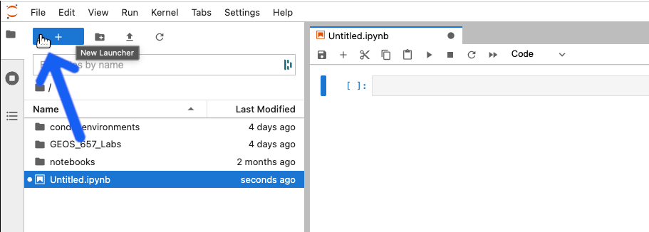
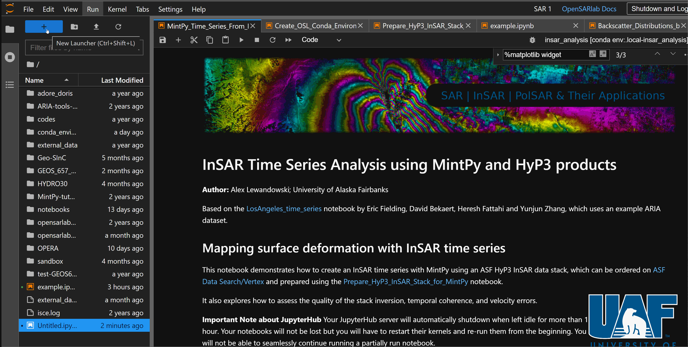
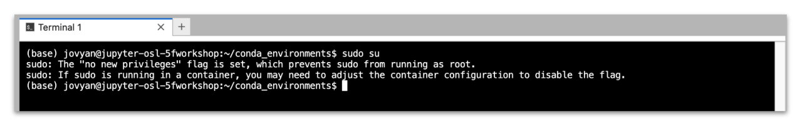

# Server Terminal

## Overview
---

Users sometimes need to use an interactive shell to organize their accounts. With OpenScienceLab’s built-in terminal, users can use an interactive shell to accomplish their tasks.

## **How to Open a Terminal**
---

1. If there is no `Launcher` tab in your workspace, open one by clicking the blue `+` button at the upper left of the screen.

1. Click the `Terminal` button in the `Launcher` tab.

*Live Example*:

---
 
## **How to Use the Terminal**

Use the command line as you would in any other `Unix-like` terminal.

---
 
## **No Root Privileges**

Because the `jovyan` does not have a password, OpenScienceLab users cannot use the `sudo` command.

