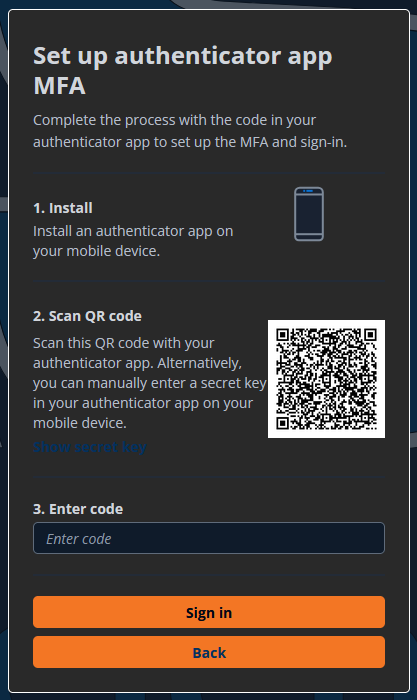
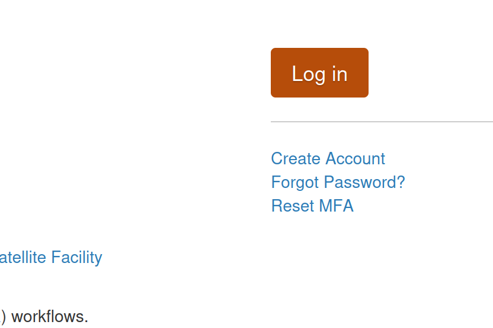
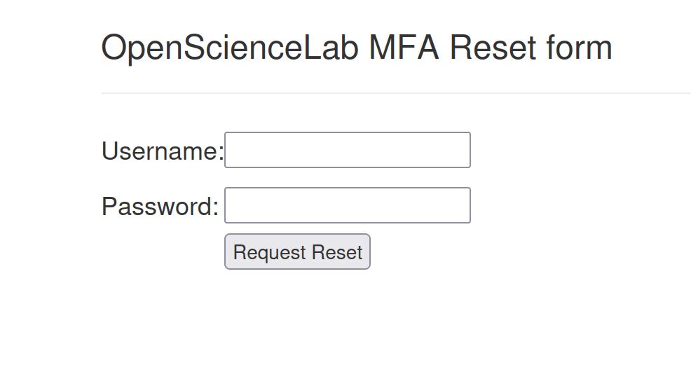
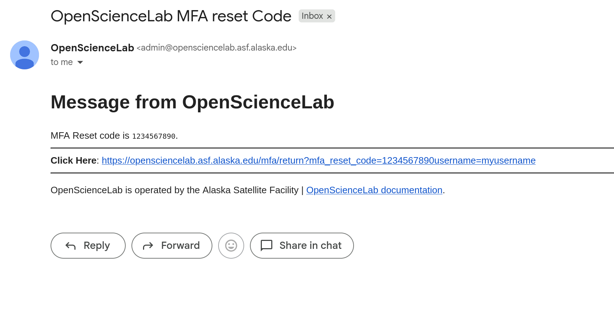
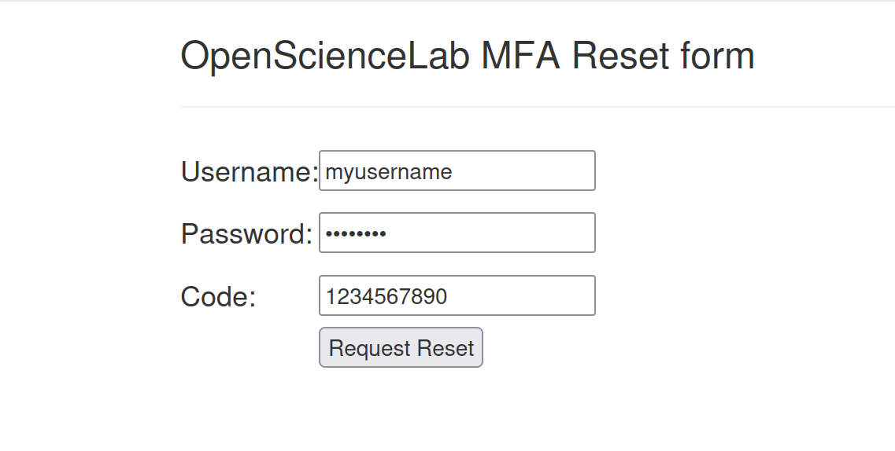
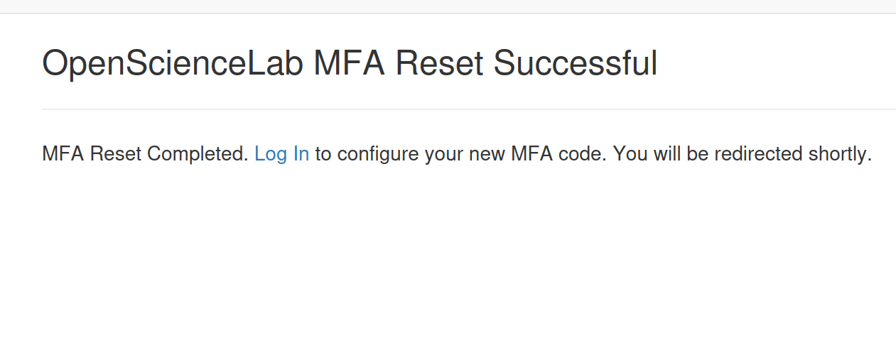

# Configuring and Resetting MFA
 

Multi-Factor Authentication (MFA) is required to access OpenScienceLab resources.

Currently, we support TOTP-based authentication

<!-- - [Watch: Log In and Set Up MFA](#Watch-Log-In-and-Set-Up-MFA) -->
- [Before You Begin](#Before-You-Begin)
- [Setup Steps](#Setup-Steps)
- [Resetting MFA](#Resetting-MFA)
- [Troubleshooting](#Troubleshooting)

<!-- ---

(Watch-Log-In-and-Set-Up-MFA)=
## Watch: Log In and Set Up MFA
:::{iframe} https://www.youtube.com/embed/2c1X9qRnsSM?si=XKHtBBzrSDgnBJNQ
::: -->

---

(Before-You-Begin)=
## Before You Begin

A TOTP-enabled MFA application is required to use OpenScienceLab resources.
While the most widely utilized approach is through a smartphone application,
there are also several desktop clients that provide this functionality.

:::{note} MFA App Support

| Application             | Desktop Support | Android Support | iOS Support |
| --------------------    | --------------- | --------------- | ----------- |
| KeePassXc               |        ✅       |       ❌        |      ❌     |
| Enpass                  |        ✅       |       ✅        |      ✅     |
| Cisco Duo               |        ✅       |       ✅        |      ✅     |
| Authenticator.cc*       |        ✅       |       ✅        |      ✅     |
| Bitwarden**             |        ✅       |       ✅        |      ✅     |
| FreeOTP                 |        ❌       |       ✅        |      ✅     |
| Google Authenticator    |        ❌       |       ✅        |      ✅     |
| Microsoft Authenticator |        ❌       |       ✅        |      ✅     |
| Aegis Authenticator     |        ❌       |       ✅        |      ❌     |
| OnePassword             |        ✅       |       ✅        |      ✅     |

\* Browser based

\*\* TOTP supported in paid version only
:::

---

(Setup-Steps)=
## Setup Steps

Follow the prompts for setting up MFA during OpenScienceLab account creation. \
Add a new MFA device:

  

In your Authenticator App, the configuration will show up as
`portalcdkstack-prod.auth.us-west-2.amazoncognito.com: {osl-username}`

---

(Resetting-MFA)=
## Resetting MFA

If you have an older OpenScienceLab MFA set up that looks like `OpenScienceLab: {osl-username}`, it is no longer valid and should be removed.

1. On the OpenScienceLab landing page, click the reset MFA button:

    
1. Fill out the MFA reset form with your username and password

    
1. In your email, find your reset email and follow the link. \
It should arrive almost immediately, if you don't see it, check your spam folder.

    
1. Back in OpenScienceLab, fill in your password to the MFA reset form

    
1. You should see a page indicating your MFA reset was successful

    
1. Log back into your account to set up your new MFA

---
(Troubleshooting)=
## Troubleshooting

1. If the MFA Code check is not successful, there are a few potential issues:
    1. One of the codes was mis-typed.
    1. You may have provided an unrelated MFA code
    1. Your code may have expired between copying and submitting it
1. If the problem persists, try [resetting your MFA](#resetting-mfa)

For additional issues and further troubleshooting, please email
[uaf-jupyterhub-asf@alaska.edu](mailto:uaf-jupyterhub-asf@alaska.edu)
