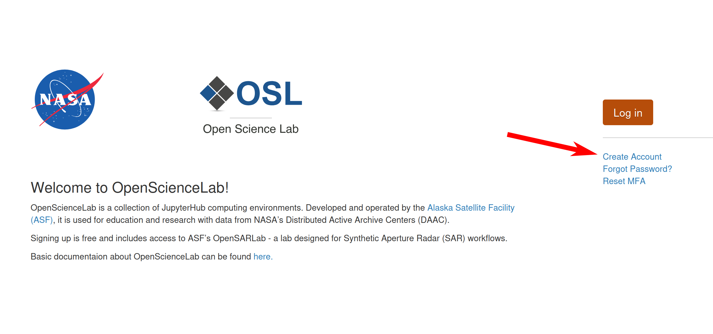
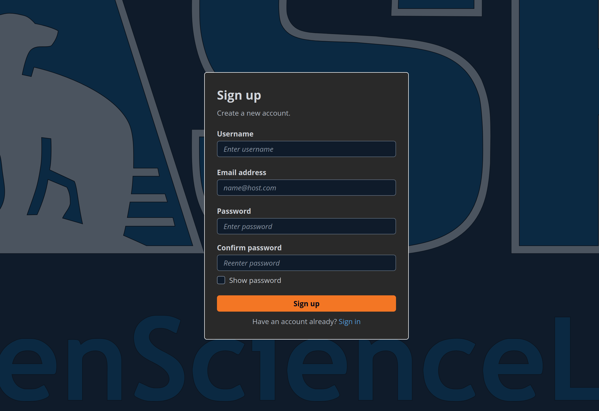
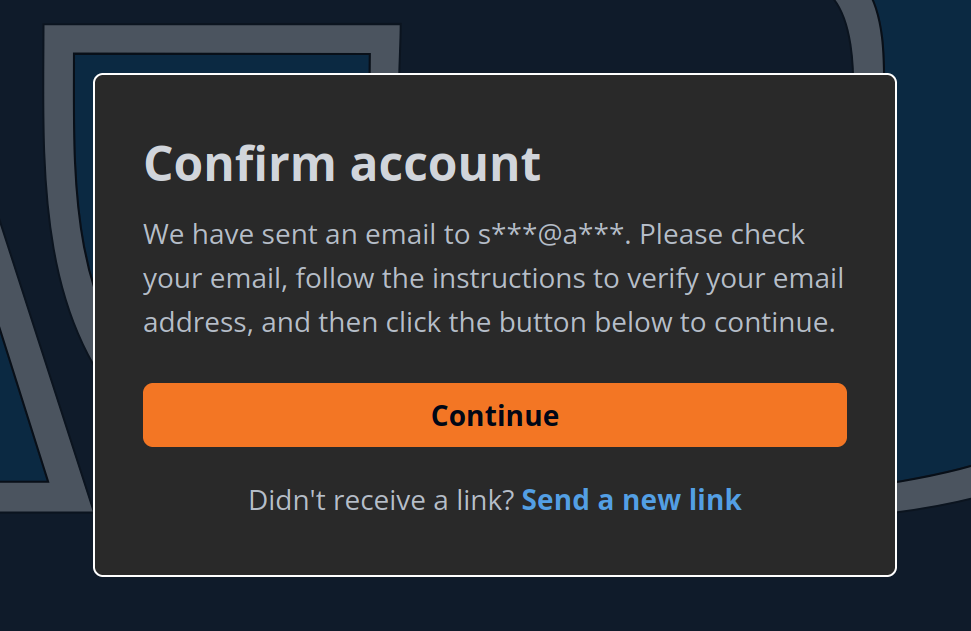
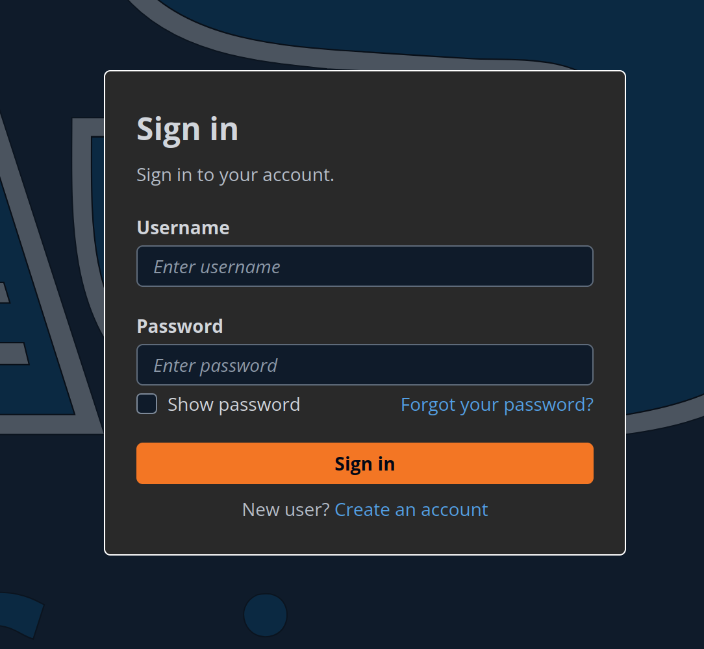
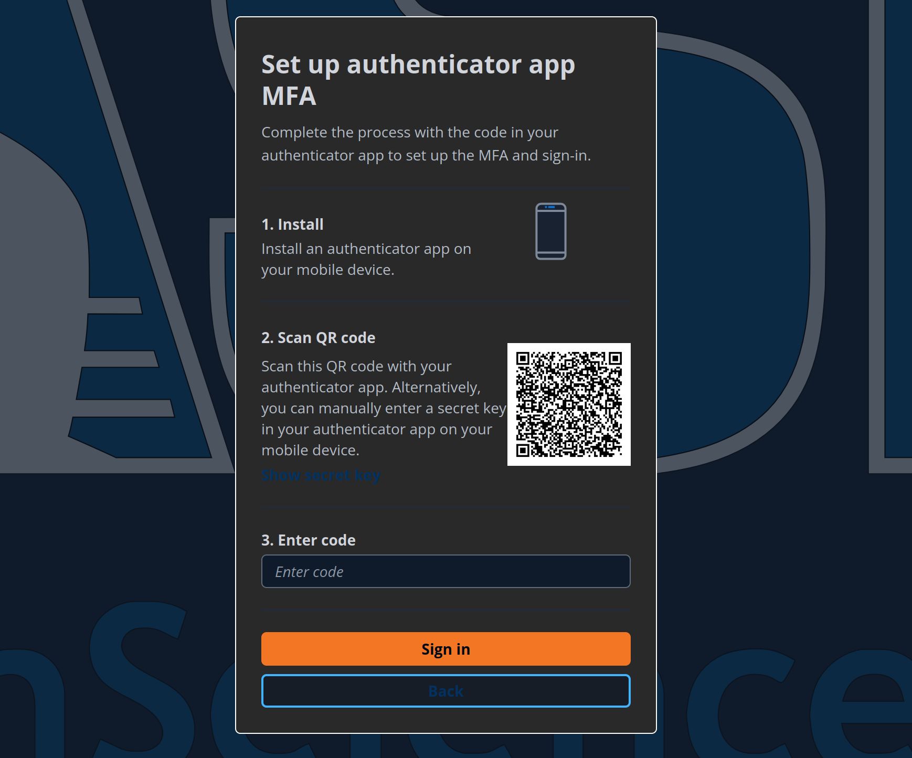
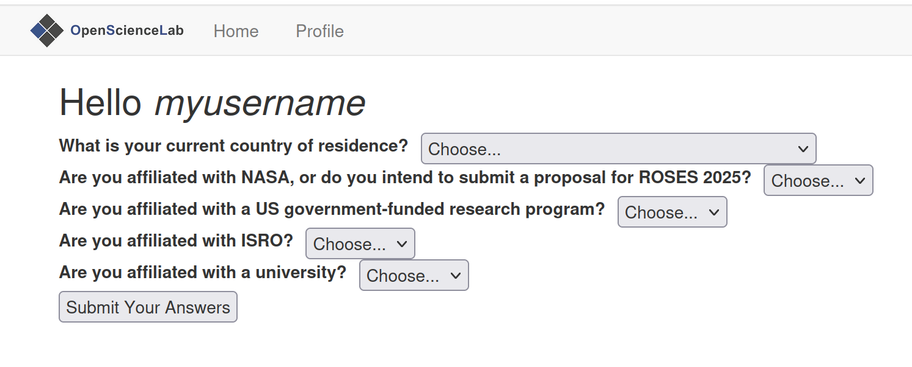

# OpenScienceLab Accounts  
 

OpenScienceLab is a single-sign-on portal providing access to ASF-managed JupyterHubs such as OpenSARLab. OpenScienceLab also hosts labs for research projects, classes, and workshops. If you are attending a class or workshop, your instructor will provide details for gaining access to the lab. 

:::{note}
ASF provides limited access to OpenSARLab. \
Applications to OpenSARLab can be completed by following the [OpenSARLab Access Application](opensarlab.md) instructions. \
NASA-affiliates are given priority on applications.

:::{tip}
Labs in OpenScienceLab are independent and do not share resources:
- If you have access to multiple labs, each will have its own storage volume and you cannot copy data directly from one to another. 
- Be mindful to use the correct lab for a given event. They are configured to support expected workflows.
:::
---
## Sign Up for an OpenScienceLab Account

**Whether accessing OpenSARLab, a class/workshop lab, or any other ASF-hosted lab, you will need an OpenScienceLab account**

1. Open a web browser and navigate to https://opensciencelab.asf.alaska.edu/

1. On the OpenScienceLab landing page, click the `Create Account` button:
    <figure>
    
    </figure>

1. Complete the Sign Up form
    <figure>
    
    </figure>

1. Click the confirmation link in your email
    <figure>
    
    </figure>

1. After your account has been confirmed, sign into your account
    <figure>
    
    </figure>

1. Set up your MFA. OpenScienceLab will appear as `portalcdkstack-prod.auth.us-west-2.amazoncognito.com`
    <figure>
    
    </figure>

1. Fill out your profile and your account creation will be completed
    <figure>
    
    </figure>
