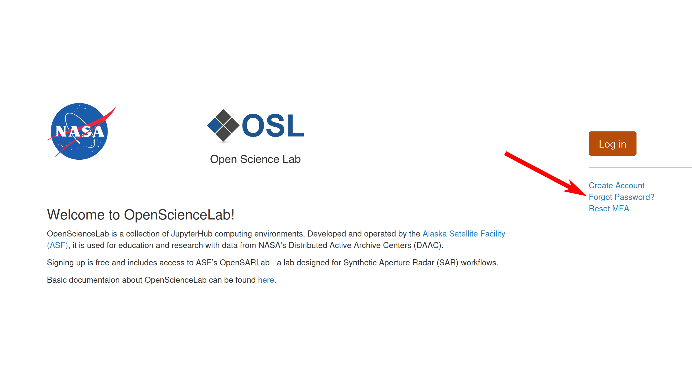
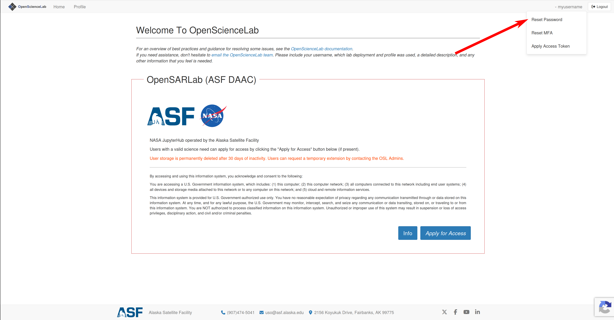
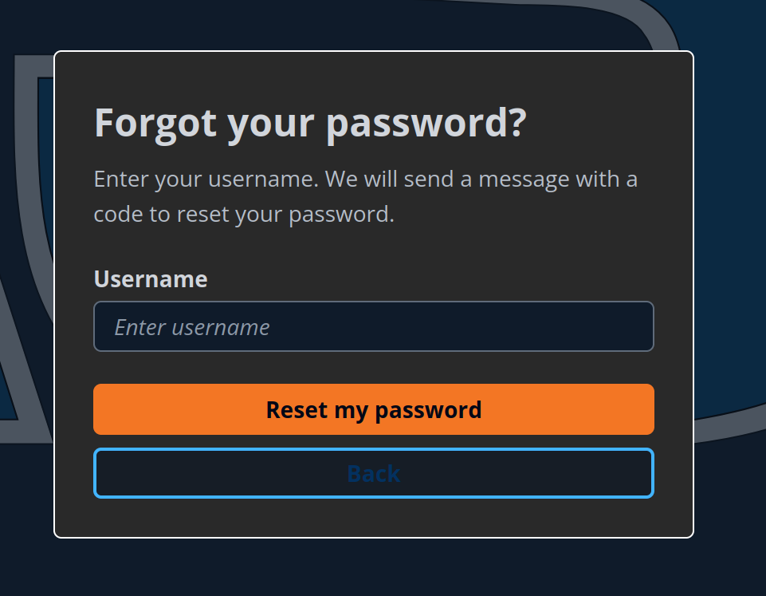
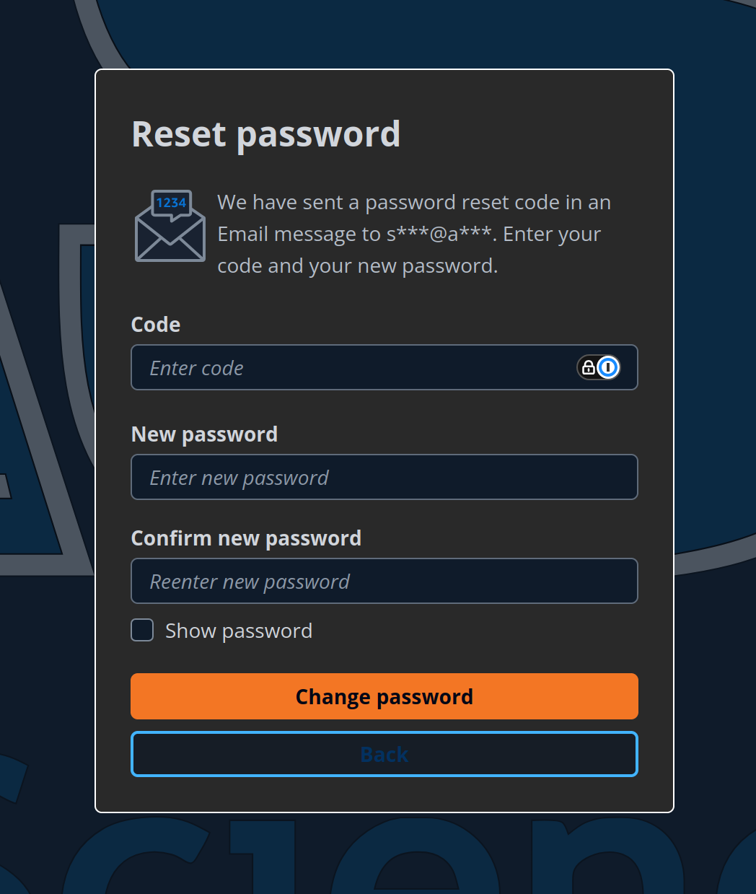
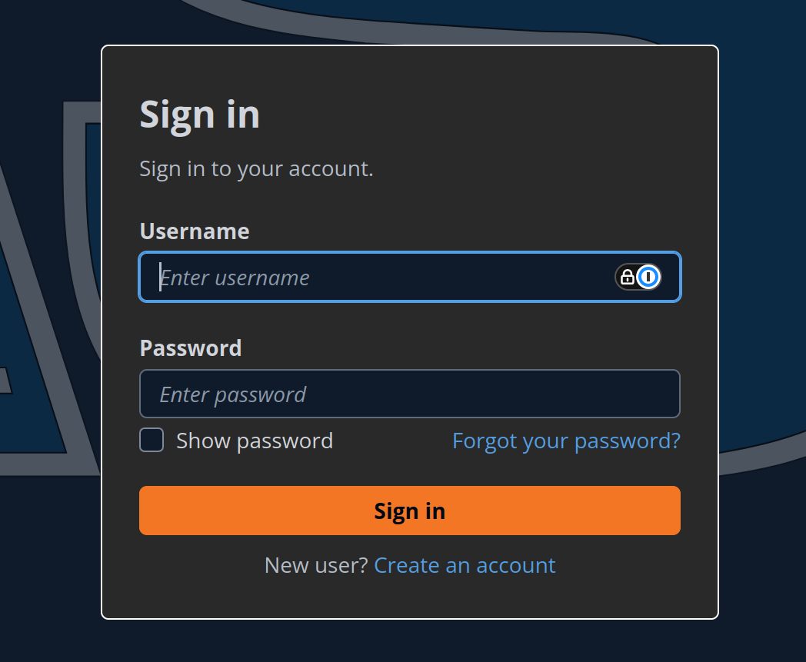

# Resetting Your OpenScienceLab Password

1. If you are logged out, click the `Forgot Password` button.
    <figure>
    
    </figure>
   If you are logged in, click on your username in the upper right corner, then click on the `Reset Password` button.
    <figure>
    
    </figure>

1. Enter your usename, this will send a code to your email.
    <figure>
    
    </figure>

1. Enter the code you recieved in your email, and type in your new password.
    <figure>
    
    </figure>

1. Sign in with your new password.
    <figure>
    
    </figure>
