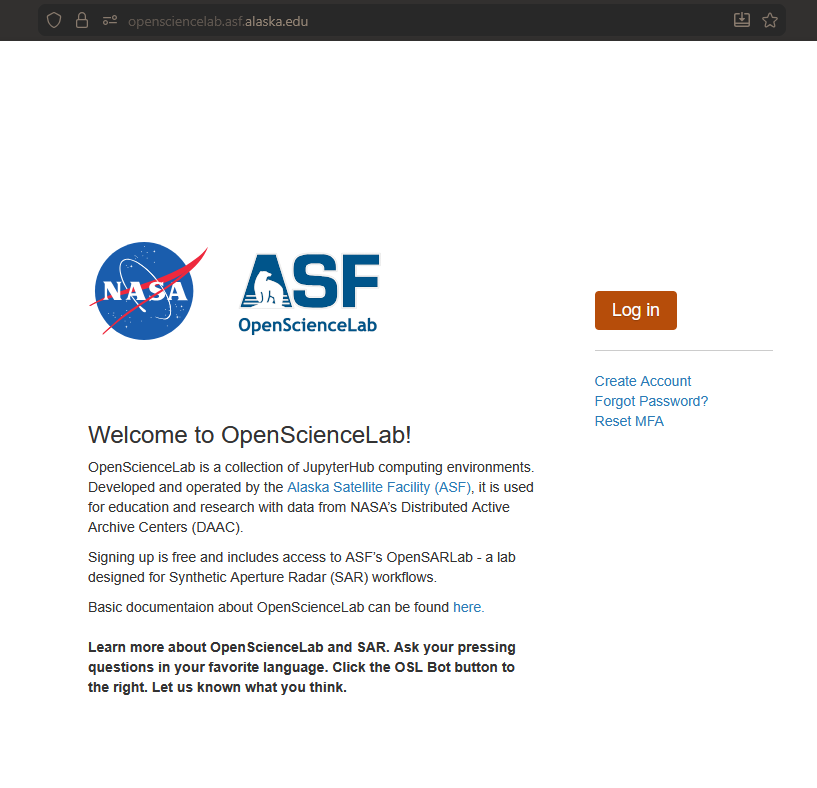
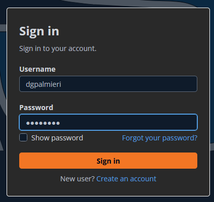
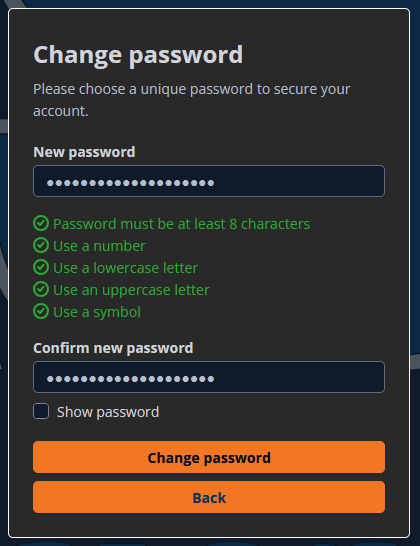
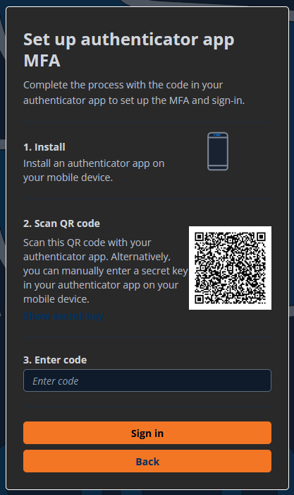
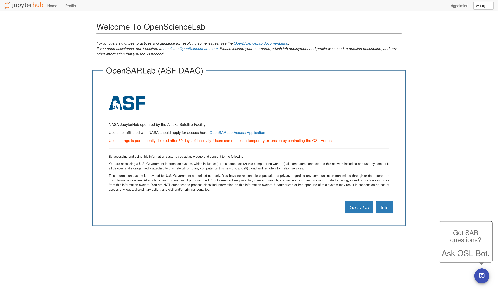
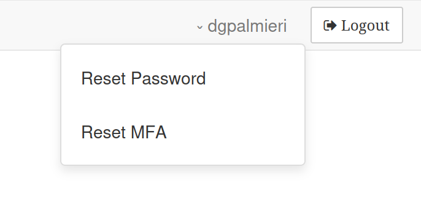

# Migrating from OpenScienceLab Portal v1 to v2

Migrating to the new OpenScienceLab Portal will be an entirely transparent process. Here
are the steps you will need to go through to access the new Portal after it's launch on
December 8th, 2025.

1. On the day of the migration, you will receive this email:  

    ```{image} ../assets/osl-temp-email.png
    :width: 642
    ```
    Clicking the link will take you to the new OpenScienceLab landing page.

1. On the OpenScienceLab landing page, click the log in button:

      

1. You'll be taken to a new page, where you can log in with your username and the
   temporary password from the email:

      

1. Set a new password that meets the complexity requirements:

      

1. Add a new MFA device:

      

    In your Authenticator App, the configuration will show up as
    `portalcdkstack-prod.auth.us-west-2.amazoncognito.com: {osl-username}`

1. After signing in, you will see the updated OSL homepage:

      

1. One of the differences with this update is where credential reset links are located.
   They are now under a dropdown you can access by clicking your username at the
   top-right of the page, next to the "Logout" button:

    
