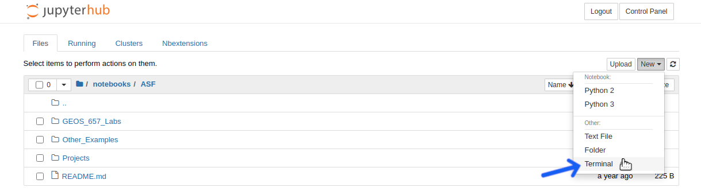
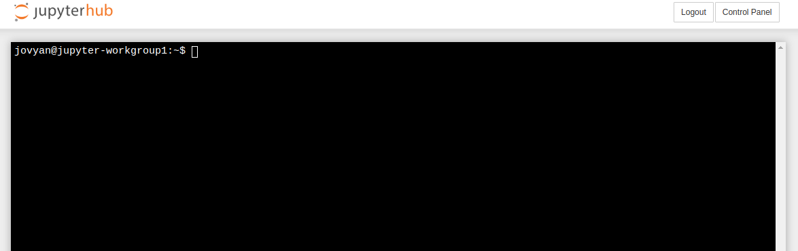
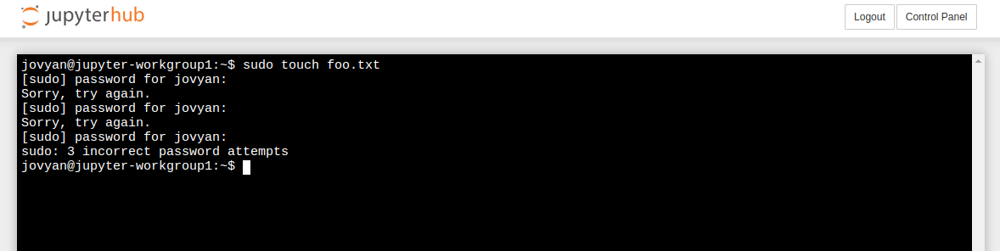

# Using The Terminal in OpenSARlab

|  | 
|:-------------:|
| *Select "Terminal" from the "New" menu in the JupyterHub file manager* |
 
|  | 
|:-------------:|
| *Use the command line as you would in any other Linux terminal* |
 
|  | 
|:-------------:|
| *OpenSARlab users do not have sudo privileges (there exists no jovyan password)* |