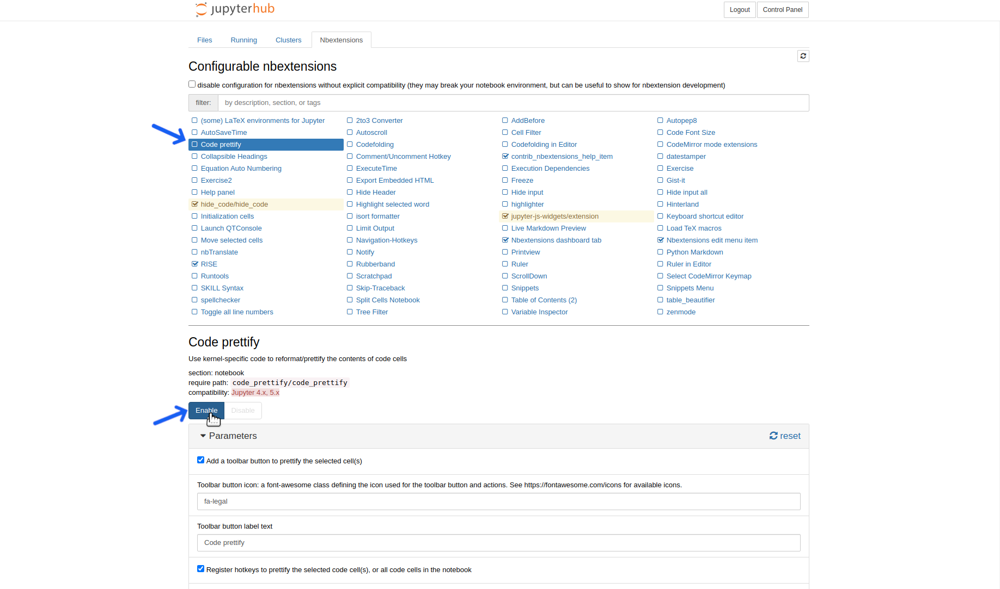

[Return to Table of Contents](OpenSARlab_user_guide.md)

# Managing Jupyter Notebook Extensions
As an OpenSARlab user, you have access to all of the notebook extensions available in the nbextensions package. A detailed list of included extensions is available [here](https://jupyter-contrib-nbextensions.readthedocs.io/en/latest/nbextensions.html).

## Enabling and Disabling Extensions

The easiest way to manage notebook extensions is via the nbextensions tab.

|  | 
|:-------------:|
| *Click the nbextensions tab from the file manager* |

Once the nbextensions tab is open, you can select individual extensions to learn how they function and enable or disable them.

|  | 
|:-------------:|
| *Select an extension to learn more about and click the "Enable" or "Disable" buttons to manage its use* |