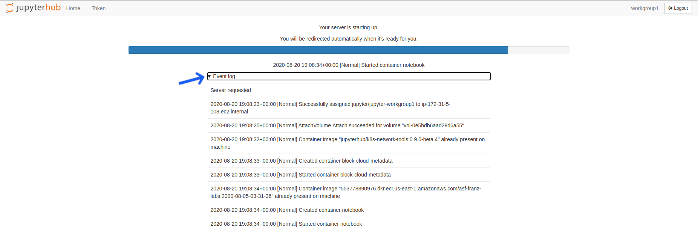
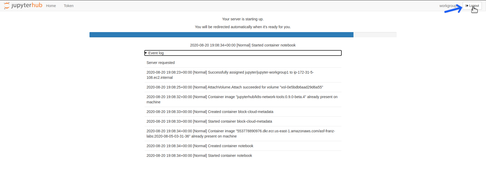

[Return to Table of Contents](OpenSARlab_user_guide.md)

# Troubleshooting Guide

- [Why did the kernel die while running a notebook?](#why-did-the-kernel-die-while-running-a-notebook)
- [I successfully ran a notebook earlier on the same data but now it is killing the kernel.](#i-successfully-ran-a-notebook-earlier-on-the-same-data-but-now-it-is-killing-the-kernel)
- [I am receiving a "No space left on device" error.](#i-am-receiving-a-no-space-left-on-device-error)
- [My server won't start and I cannot access OpenSARlab.](#my-server-wont-start-and-i-cannot-access-opensarlab)
- [The edits I made to an ASF notebook have disappeared since the last time I used OpenSARlab.](#the-edits-i-made-to-an-asf-notebook-have-disappeared-since-the-last-time-i-used-opensarlab)
- [One of my notebooks looks like it has a mix of code from various versions of the notebook.](#one-of-my-notebooks-looks-like-it-has-a-mix-of-code-from-various-versions-of-the-notebook)
- [I know there was an update made to an ASF notebook but I still have the old version.](#i-know-there-was-an-update-made-to-an-asf-notebook-but-i-still-have-the-old-version)
- [My code requires a different version of a software package than what is currently installed in OpenSARlab.](#my-code-requires-a-different-version-of-a-software-package-than-what-is-currently-installed-in-opensarlab)
- [I am having trouble setting up a web server and developing my web app in OpenSARlab.](#i-am-having-trouble-setting-up-a-web-server-and-developing-my-web-app-in-opensarlab)
- [A notebook won't load. A new browser tab opens and shows the JupyterHub header, but no notebook appears.](#a-notebook-wont-load-a-new-browser-tab-opens-and-shows-the-jupyterhub-header-but-no-notebook-appears)
- [My issue is not on this list](#my-issue-is-not-on-this-list)

## Why did the kernel die while running a notebook?
 |  | 
 |:-------------:|
 | *The message that appears when a notebook kernel dies* |
 
 The kernel will die if you run out of available memory to complete a running process. This most frequently occurs when running a time-series or change detection algorithm on a data stack that is either too deep or covers too large an area-of-interest for OpenSARlab to handle. Try running the notebook on some combination of a shallower data stack and/or a smaller area-of-interest. This may take some experimentation because memory is shared among users and the amount available fluctuates. To work with a deep stack covering an extensive AOI, you may need to tile up your data for the analysis and mosaic them later. 

## I successfully ran a notebook earlier on the same data but now it is killing the kernel.

OpenSARlab EC2 instances are shared among 1-3 users. The memory available to each user on an instance varies with overall activity on the EC2. It is likely that there was enough memory available for your process the first time you attempted it, but there wasn't on the subsequent attempt. More details on the OpenSARlab user environment can be found [here](OpenSARlab_environment.md).

## I am receiving a "No space left on device" error.
OpenSARlab users have access to a finite amount of storage space ([details here](OpenSARlab_environment.md)). It is up to users to manage their storage. If you receive a storage space warning while logged into OpenSARlab, it is highly recommended that you immediately free up space by deleting un-needed files. If your server shuts down while there is no available space, it will not have the space needed to restart again and you will be locked out of your account. 

If you you become locked out of your account, contact an [OpenSARlab administrator](mailto:uaf-jupyterhub-asf@alaska.edu) for help. They will assign just enough extra storage to allow you to login and delete files.

If you do not have any extraneous files to delete and feel that you really do need additional space to do your work, contact an [OpenSARlab administrator](mailto:uaf-jupyterhub-asf@alaska.edu) and request an increased storage limit. Limits will only be increased if there is a demonstrable need.

## My server won't start and I cannot access OpenSARlab.
This issue typically stems from unexpected behavior on the part of the [smart git puller](https://jupyterhub.github.io/nbgitpuller/).

Click the event log arrow beneath the server startup progress bar to view the details of any git puller conflicts.

 |  | 
 |:-------------:|
 | *Click the event log arrow beneath the server startup progress bar.* |
 
 If the problem is related to the git puller, you will find details regarding which file or files are causing the conflict in the event log. If the problem is not related to the git puller, contact an [OpenSARlab Administrator](mailto:uaf-jupyterhub-asf@alaska.edu).
 
 If the problem is git puller related, note the names and locations of the offending files and logout of OpenSARlab.
 
 |  | 
 |:-------------:|
 | *Click the logout button at the top of the screen* |
 
 After logging out, the startup screen will reload. Select the "General SAR processing (without git puller)" server option and click the start button. 
 
 |  | 
 |:-------------:|
 | *Select the "General SAR processing (without git puller)" server option and click the start button* |
 
 The server should now load and you will have access to your account. Navigate to the locations of the conflicting files. There are three options for dealing with each of the offending files:
 
 1. Delete the file if there are no changes from the original that you wish to save. 
 1. Rename the file if there are changes you wish to save.
 1. From the [terminal](OpenSARlab_terminal.md), run "touch /path/to/your.file" if you wish to try updating the file's timestamp and give the git puller another opportunity to handle the git pull correctly.
 
 Logout of OpenSARlab.
 
 |  | 
 |:-------------:|
 | *Click the logout button at the top right of the screen* |
 
 Log back in, using the "General SAR processing" server option.
 
 |  | 
 |:-------------:|
 | *Select the "General SAR processing" option and click start* |
 
 The git puller should now run successfully, the server should startup, and you should have restored access to OpenSARlab, receiving any updates to the [ASF notebook library](https://github.com/asfadmin/asf-jupyter-notebooks).

## The edits I made to an ASF notebook have disappeared since the last time I used OpenSARlab.

When your OpenSARlab server starts up, a git puller runs, bringing in any updates made to the [ASF notebook library](https://github.com/asfadmin/asf-jupyter-notebooks). If a change has been made to a notebook by both the user and by ASF, both will be saved. The ASF version will retain its original name. The user edited version will have a timestamp appended to its name. The edited notebook you are missing is likely in the location where you expect it but has a recent timestamp appended to its name.  

## One of my notebooks looks like it has a mix of code from various versions of the notebook.

We have seen this happen occasionally and it stems from issues with the [smart git puller](https://jupyterhub.github.io/nbgitpuller/). The best option is to delete the notebook and [restart your OpenSARlab server](restarting_server_and_kernel.md). The notebook will be replaced with a fresh copy from the [ASF notebook library](https://github.com/asfadmin/asf-jupyter-notebooks).

## I know there was an update made to an ASF notebook but I still have the old version.

We have seen this happen occasionally and it stems from issues with the [smart git puller](https://jupyterhub.github.io/nbgitpuller/). The best option is to delete the outdated version of the notebook and [restart your OpenSARlab server](restarting_server_and_kernel.md). The notebook will be replaced with a fresh copy from the [ASF notebook library](https://github.com/asfadmin/asf-jupyter-notebooks).

## My code requires a different version of a software package than what is currently installed in OpenSARlab.

Install the required version of a pip installable package to your .local directory. This can be done from the [terminal](OpenSARlab_terminal.md) with the command "pip install --user package_name==0.1.2" (using the correct package name and version number).

## I am having trouble setting up a web server and developing my web app in OpenSARlab.

This cannot be done in OpenSARlab. You will need to develop your app in an environment where you can run your web server.

## A notebook won't load. A new browser tab opens and shows the JupyterHub header, but no notebook appears. 

This is caused by the slow loading of a large notebook. If you run a notebook and close it without first clearing all code cell output, the file size can increase substantially. A 40KB notebook can grow to 60MB+ file if its output is left in place. The notebook will eventually load. You may need to reload your browser window if it times out. 

## My issue is not on this list

If you have encountered an issue not covered in this document, please contact an [OpenSARlab administrator](mailto:uaf-jupyterhub-asf@alaska.edu) for help.
