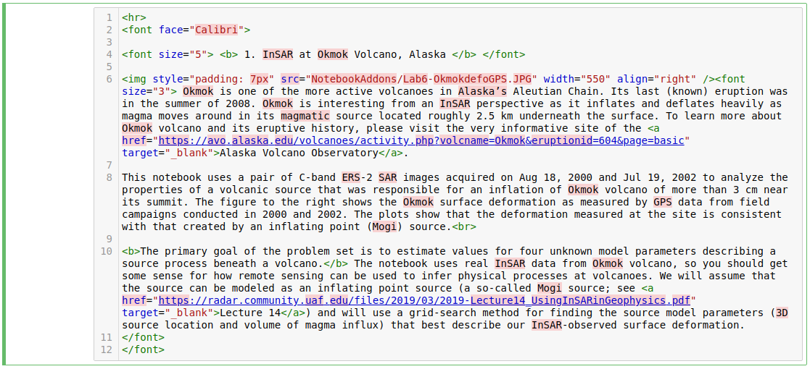

# Jupyter Notebook
https://jupyter.org/

Jupyter Notebook is a web application that allows users to display interactive, runnable code 
cells (typically written in Python) alongside markdown cells containing explanatory text, 
formulas, hyperlinks, tables, pseudocode, and images.

As such, they provide an ideal format for teaching/learning coding concepts, prototyping 
algorithms, and collaborating on Python projects.

Jupyter Notebook has 4 cell types. In OpenSARlab, we use two of them, "markdown cells" and 
"code cells."
 
### Markdown Cells
Markdown cells contain documentation in Markdown, HTML, and/or Latex. They may contain text, images, 
hyperlinks, formulas, tables, pseudocode, plots, and figures. 

-  To enter edit mode in a markdown cell, double click it.

 |  | 
 |:-------------:|
 | *A markdown cell in edit mode* |
 
- To move past or display a markdown cell's content, run it. 
 
 |  | 
 |:-------------:|
 | *A run markdown cell* |
 
 ### Code Cells