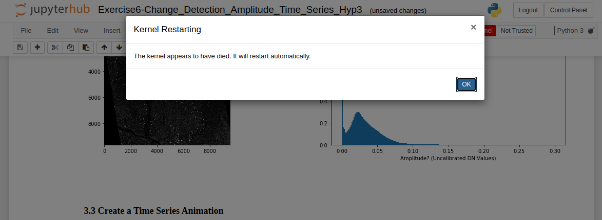

# Troubleshooting Guide

- [Why did the kernel die while running a notebook?](#why-did-the-kernel-die-while-running-a-notebook)
- [I successfully ran a notebook earlier on the same data but now it is killing the kernel.](#i-successfully-ran-a-notebook-earlier-on-the-same-data-but-now-it-is-killing-the-kernel)
- [I am receiving a "No space left on device" error.](#i-am-receiving-a-no-space-left-on-device-error)
- [My server won't start and I cannot access OpenSARlab.](#my-server-wont-start-and-i-cannot-access-opensarlab)
- [The edits I made to an ASF notebook have disappeared since the last time I used OpenSARlab.](#the-edits-i-made-to-an-asf-notebook-have-disappeared-since-the-last-time-i-used-opensarlab)
- [One of my notebooks looks like it has a mix of code from various versions of the notebook.](#one-of-my-notebooks-looks-like-it-has-a-mix-of-code-from-various-versions-of-the-notebook)
- [I know there was an update made to an ASF notebook but I still have the old version.](#i-know-there-was-an-update-made-to-an-asf-notebook-but-i-still-have-the-old-version)
- [My code requires a different version of a software package than what is currently installed in OpenSARlab.](#my-code-requires-a-different-version-of-a-software-package-than-what-is-currently-installed-in-opensarlab)
- [I am having trouble setting up a web server and developing my web app in OpenSARlab.](#i-am-having-trouble-setting-up-a-web-server-and-developing-my-web-app-in-opensarlab)
- [A notebook won't load. A new browser tab opens and shows the JupyterHub header, but no notebook appears.](#a-notebook-wont-load-a-new-browser-tab-opens-and-shows-the-jupyterhub-header-but-no-notebook-appears)

#### Why did the kernel die while running a notebook?
 |  | 
 |:-------------:|
 | *The message that appears when a notebook kernel dies* |
 
 The kernel will die if you run out of available memory to complete a running process. This most frequently occurs when running a time-series or change detection algorithm on a data stack that is either too deep or covers too large an area-of-interest for OpenSARlab to handle. Try running the notebook on some combination of a shallower data stack and/or a smaller area-of-interest. This may take some experimentation because memory is shared among users and the amount available fluctuates. To work with a deep stack covering an extensive AOI, you may need to tile up your data for the analysis and mosaic them later. 

#### I successfully ran a notebook earlier on the same data but now it is killing the kernel.

OpenSARlab EC2 instances are shared among 1-3 users. The memory available to each user on an instance varies with overall activity on the EC2. It is likely that there was enough memory available for your process the time you attempted it, but there wasn't on the subsequent attempt. More details on the OpenSARlab user environment can be found [here](OpenSARlab_environment.md).

#### I am receiving a "No space left on device" error.
OpenSARlab users have access to a finite amount of storage space ([details here](OpenSARlab_environment.md)). It is up to users to manage their storage. If you receive such a warning while logged into OpenSARlab, it is highly recommended that you immediately free up space by deleting un-needed files. If your server shuts down while there is no available space, it will not have the space needed to restart again and you will be locked out of your account. 

If you you become locked out of your account, contact an [OpenSARlab administrator](mailto:uaf-jupyterhub-asf@alaska.edu) for help. They will assign just enough extra storage to allow you to login and delete files.

If you do not have any extraneous files to delete and feel that you really do need additional space to do your work, contact an [OpenSARlab administrator](mailto:uaf-jupyterhub-asf@alaska.edu) and request an increased storage limit. Limits will only be increased if there is a demonstrable need.

#### My server won't start and I cannot access OpenSARlab.
This issue typically stems from unexpected behavior on the part of the [smart git puller](https://jupyterhub.github.io/nbgitpuller/).

#### The edits I made to an ASF notebook have disappeared since the last time I used OpenSARlab.

#### One of my notebooks looks like it has a mix of code from various versions of the notebook.

#### I know there was an update made to an ASF notebook but I still have the old version.

#### My code requires a different version of a software package than what is currently installed in OpenSARlab.

#### I am having trouble setting up a web server and developing my web app in OpenSARlab.

#### A notebook won't load. A new browser tab opens and shows the JupyterHub header, but no notebook appears. 

